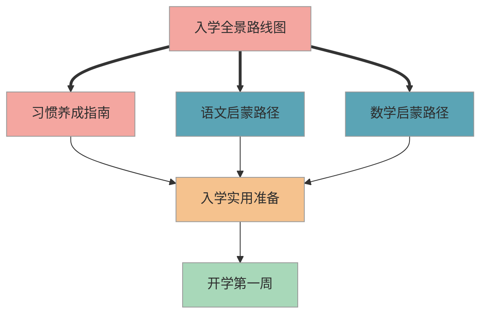

# K0 幼小衔接

> 幼小衔接是家长焦虑指数最高的阶段。本入口帮你快速定位所有准备方向，从容规划入学前的每一步。

## 1. 阶段概述

**适用对象**：即将入学的孩子（大班至入学前）及其家长

**核心目标**：帮孩子在习惯、知识、心理三个维度做好入学准备，让你从"不知道该准备什么"变成"心中有数、节奏可控"

**时间范围**：入学前 12 个月至入学后第 1 个月

**阶段定位**：这是整个小学旅程的起点。你不需要提前学完一年级的内容——2022 版新课标明确要求一年级上学期为"入学适应期"，教学从零起点开始。K0 的核心是帮孩子建立"准备好上学"的状态：坐得住、管得了自己、对学习有基本的好奇心。

## 2. 目录结构

本阶段的内容按以下方式组织，方便你快速定位：

```
K0-preschool/
├── navigation/              # 导航文件（多视角快速浏览）
│   ├── 幼小衔接入学全景路线图.md   # 全局视野：方向 + 优先级 + 时间节奏
│   ├── 重难点速查.md               # 6 个重点 + 1 个难点，30 分钟抓住核心
│   ├── 易错点清单.md               # 43 条易错点汇总，辅导时直接翻
│   └── 家长行动清单.md             # 59 条实操建议，告诉你该做什么
├── content/                 # 具体内容（按模块分类）
│   ├── habits/              # 习惯养成（专注力、握笔、整理、社交）
│   ├── chinese/             # 语文启蒙（拼音、识字、阅读）
│   ├── math/                # 数学启蒙（凑十破十、数感、图形）
│   └── practical/           # 入学实用准备（物品清单、第一周指南）
└── delivery/                # 交付生成物（Git 忽略）
    └── images/              # Mermaid 渲染的 PNG 图片
```

## 3. 内容目录

### 3.1 入学全景路线图（P0）

| 内容 | 说明 | 链接 |
|------|------|------|
| 幼小衔接入学全景路线图 | 一张图看清所有准备方向、优先级和时间节奏 | [查看](navigation/幼小衔接入学全景路线图.md) |

### 3.2 习惯养成指南（P0）

| 内容 | 说明 | 链接 |
|------|------|------|
| 专注力训练方法 | 从 5 分钟渐进到 30 分钟的分步训练方案 | [查看](content/habits/专注力训练方法.md) |
| 握笔姿势与坐姿 | 正确握笔和坐姿的建立方法，避免入学后纠错成本 | [查看](content/habits/握笔姿势与坐姿.md) |
| 书包整理与文具管理 | 培养孩子自主管理学习用品的习惯 | [查看](content/habits/书包整理与文具管理.md) |
| 社交适应指南 | 帮孩子理解课堂规则、学会同伴交往和主动求助 | [查看](content/habits/社交适应指南.md) |

### 3.3 语文启蒙路径（P0）

| 内容 | 说明 | 链接 |
|------|------|------|
| 声母韵母分类与拼读 | 23 个声母 + 24 个韵母的系统认知与拼读入门 | [查看](content/chinese/声母韵母分类与拼读.md) |
| 基础汉字分级识读 | 按使用频率和书写难度分级的学前识字路径 | [查看](content/chinese/基础汉字分级识读.md) |
| 亲子阅读指导 | 选书建议、共读方法和阅读习惯的养成策略 | [查看](content/chinese/亲子阅读指导.md) |

### 3.4 数学启蒙路径（P1）

| 内容 | 说明 | 链接 |
|------|------|------|
| 凑十法与破十法 | 20 以内加减法的核心方法，附分步操作图解 | [查看](content/math/凑十法与破十法.md) |
| 数感建立与数量对应 | 从实物操作到抽象数字的认知过渡方法 | [查看](content/math/数感建立与数量对应.md) |
| 图形认知与逻辑启蒙 | 基础图形辨认和简单逻辑推理的启蒙活动 | [查看](content/math/图形认知与逻辑启蒙.md) |

### 3.5 入学实用准备（P1）

| 内容 | 说明 | 链接 |
|------|------|------|
| 入学物品准备清单 | 分类整理的入学必备物品与选购建议 | [查看](content/practical/入学物品准备清单.md) |
| 开学第一周生存指南 | 第一周常见状况应对和家长心态调整 | [查看](content/practical/开学第一周生存指南.md) |

## 4. 学习路径建议

下图展示本阶段各模块的推荐阅读顺序，三条路径可以并行推进：



**建议阅读顺序**：

1. **先看全景路线图**：花 10 分钟建立全局视野，了解要准备哪些方向、什么时候开始
2. **优先抓习惯养成**：这是最重要也最容易被忽略的模块——专注力和自理能力比认多少字更影响入学适应
3. **语文和数学并行推进**：两条启蒙路径可以同步进行，每天各 15 分钟即可
4. **入学前 2 个月集中完成实用准备**：物品采购和心理建设放在最后阶段，不必太早操心

## 5. 本阶段重点提示

1. **习惯比知识更重要**：坐得住、管得了自己的东西、能听懂并执行老师的指令——这些比多认几个字更决定入学后的适应速度
2. **课标从零起点教学**：2022 版新课标明确要求一年级教学从零开始，你不需要提前教完一年级内容，建立基础认知和学习兴趣就足够了
3. **每天 15-20 分钟就够了**：学龄前孩子的有效专注时间有限，短时高频远比长时间坐桌前效果好
4. **认准"必须掌握"项**：全景路线图中区分了"必须掌握 / 提前会更好 / 入学后再学也行"三个层级，把精力集中在第一层
5. **你的心态是隐藏变量**：家长的焦虑会直接传递给孩子——保持"准备充分但不过度紧张"的状态，就是对孩子最好的衔接

---

*最后更新：2026-03-06*
