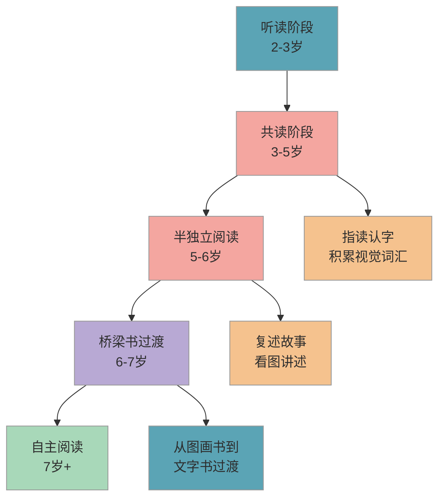

# 亲子阅读指导

> 亲子阅读是最简单、最有效的语文启蒙方式。每天 15-20 分钟，不需要你有教育学背景，只需要一本书、一段安静的时光，就能帮孩子打下受益终身的阅读基础。

## 1. 知识点概述

很多家长一提到"语文启蒙"，脑海里就浮现识字卡、拼音表。但课标在"学习准备"维度明确提出：**培养幼儿阅读兴趣和能力，鼓励自主阅读**。注意这里的关键词是"兴趣"，不是"数量"。

**亲子阅读**之所以被称为最有效的语文启蒙方式，是因为它同时做了三件事：

- **语言发展**：孩子在听故事的过程中，自然积累词汇量和句式感，为将来的识字、阅读理解和写作打基础
- **专注力培养**：从坐下来听完一本绘本开始，孩子的注意力持续时间在逐步延长
- **想象力与思维能力**：好的绘本和故事会引发孩子的思考和提问，这正是"好奇好问"的学习品质

你不需要"教"孩子阅读，你需要做的是**陪孩子享受阅读**。当阅读和愉快的亲子时光绑定在一起，孩子会自然而然地爱上书。

## 2. 核心内容

### 2.1 阅读能力发展路径

孩子的阅读能力不是一步到位的，而是沿着一条清晰的路径逐步发展。下图展示了从亲子共读到自主阅读的典型发展阶段：

每个阶段没有严格的年龄分界线，孩子的发展节奏各不相同。**你需要观察的是孩子当前处于哪个阶段，而不是纠结"这个年龄应该到哪个阶段"。**

### 2.2 怎么读：三种实用共读方法

很多家长的困惑不是"要不要读"，而是"怎么读才有效"。以下三种方法简单易学，你可以根据孩子的年龄和兴趣灵活搭配使用。

#### 2.2.1 提问式共读法

读故事时不只是"念"给孩子听，而是通过提问引导孩子参与思考。

- **读前提问**："你看封面上画了什么？你猜这个故事讲的是什么？"
- **读中提问**："小兔子接下来会怎么做？你觉得他为什么难过？"
- **读后提问**："你最喜欢故事里的谁？如果是你，你会怎么做？"

提问的目的不是"考"孩子，而是让阅读变成双向对话。如果孩子暂时不想回答，也完全没关系。

#### 2.2.2 指读法

用手指指着文字，一边读一边让孩子看到你指向的字。这个方法的好处是：

- 帮助孩子建立"文字和声音的对应关系"
- 孩子会在反复阅读中自然认识一些高频字
- 不需要刻意教认字，孩子自己就会开始"发现"文字

**注意**：指读是顺带的，不要变成"认字课"。如果孩子对文字不感兴趣，看图画也完全可以。

#### 2.2.3 角色扮演法

读对话较多的故事时，你和孩子分别扮演不同角色，用不同的语气和表情来"演"故事。

- 适合 4 岁以上、已经熟悉共读的孩子
- 能极大提升孩子的参与感和语言表达能力
- 读完还可以一起用玩具"重演"故事

### 2.3 读什么：按阶段选择书单类型

不同年龄段适合的阅读材料有所不同。以下是按阶段推荐的**书单类型**（而非具体书目），你可以根据孩子的兴趣在每个类型中选择：

#### 2.3.1 2-4 岁：以图为主的绘本

- **认知类绘本**：颜色、形状、动物、交通工具等基础认知（适合 2-3 岁）
- **生活习惯绘本**：刷牙、睡觉、上厕所等日常主题（适合 2-4 岁）
- **情绪管理绘本**：帮助孩子认识和表达情绪（适合 3-4 岁）
- 特点：文字少、图画大、故事简单、重复性强

#### 2.3.2 4-6 岁：故事性绘本

- **故事类绘本**：有完整情节的图画书，适合亲子对话和讨论（适合 4-6 岁）
- **科普类绘本**：用图画讲解自然、科学知识，满足好奇心（适合 4-6 岁）
- **传统文化绘本**：成语故事、民间传说的绘本版本（适合 5-6 岁）
- 特点：故事完整、文字渐多、可以讨论、激发想象

#### 2.3.3 6-7 岁：桥梁书过渡

- **桥梁书**：图文各半，帮助孩子从"看图"过渡到"读字"（适合 6-7 岁）
- **注音读物**：带拼音标注的短篇故事，适合开始自主阅读的孩子（适合 6-7 岁）
- 特点：文字比例增大、故事章节化、可以尝试独立阅读

### 2.4 多久读一次：建立阅读习惯

建立阅读习惯的关键不是"一次读多久"，而是**每天都读**。

- **推荐时长**：每天 15-20 分钟，不必更长
- **固定时间**：建议选择每天同一个时间段，比如睡前或晚饭后
- **固定地点**：在家里布置一个小小的"阅读角"，哪怕只是一个靠垫加一盏台灯
- **不强迫**：如果孩子某天不想读，可以换一本、缩短时间，或者改为你自己读书让孩子看到

**关于阅读量**：不要追求"一年读 100 本"这样的数字。一本好书反复读五遍，比囫囵吞枣读五本更有价值。孩子喜欢的书重复读是非常正常的。

## 3. 学习方法

### 3.1 从"听故事"到"讲故事"

当孩子听了足够多的故事后，你可以开始引导他"讲"故事：

- **复述练习**：读完一本熟悉的绘本，让孩子看着图画给你讲一遍
- **续编故事**：故事读到一半停下来，问孩子"你觉得后面会发生什么"
- **看图说话**：拿一本没读过的绘本，让孩子只看图画来编故事

这些练习能有效锻炼孩子的**语言组织能力和逻辑思维**，也是一年级"看图写话"的前置训练。

### 3.2 在生活中延伸阅读

阅读不只是"翻书"。你可以在日常生活中创造阅读场景：

- 一起看超市里的商品标签和招牌
- 走在路上读路牌、站牌上的字
- 一起看菜谱做一道简单的菜
- 让孩子帮忙"读"快递上的收件信息

这些日常场景让孩子感受到"文字是有用的"，比坐在桌前认字更能激发阅读动力。

### 3.3 建立家庭阅读氛围

孩子的阅读习惯很大程度上取决于家庭环境：

- **你自己也要读书**：哪怕每天只读 10 分钟，让孩子看到"爸爸妈妈也在读"
- **书要放在随手能拿到的地方**：客厅、卧室、甚至卫生间都可以放几本
- **定期去图书馆或书店**：把这当成一项家庭活动，而不是"任务"
- **少用"读书"作为奖惩工具**：不要说"不听话就不给你讲故事了"

## 4. 亲子互动建议

### 4.1 易错点

- ❌ 把亲子阅读变成"识字课"，每读到一个字就停下来考孩子 → ✅ 阅读时以故事和乐趣为主，认字是自然附带的结果。如果孩子主动问"这是什么字"，再顺势回答

- ❌ 因为孩子坐不住就放弃，觉得"我家孩子不爱看书" → ✅ 2-3 岁的孩子专注力只有 5-10 分钟是完全正常的。选择更短、更有趣的书，从 5 分钟开始慢慢延长，不要一上来就要求 20 分钟

- ❌ 追求阅读数量，在社交平台上跟风"一年读 200 本"打卡 → ✅ 关注阅读质量和孩子的兴趣，一本喜欢的书反复读也是有效阅读。**重复是幼儿学习的重要方式**

### 4.2 实操建议

1. **今天就开始**：选一本孩子感兴趣的绘本，在睡前花 10 分钟和孩子一起读。不需要任何准备，拿起书就行
2. **设立"阅读角"**：在孩子卧室或客厅角落放一个小书架（或收纳箱），配一个靠垫，让孩子有专属的阅读空间
3. **每周去一次图书馆**：让孩子自己选 3-5 本书带回家。选什么都行，漫画也可以，重点是让孩子感受"选书的快乐"
4. **准备一个"阅读记录本"**：每读完一本书，让孩子画一幅画记录最喜欢的场景。不用写字，画画就行
5. **固定亲子阅读时间**：每天晚上 8 点到 8 点 20 分（或你方便的时间），把这 20 分钟当成和孩子的专属时光

### 4.3 常见问题

**Q：孩子只喜欢同一本书，反复要求读同一个故事，正常吗？**

完全正常，而且这是好事。幼儿通过重复来建立安全感和加深理解。你可以在第 N 遍的时候尝试不同的提问方式，或者用不同的语气读，让"老故事"也能有新收获。

**Q：孩子只看图不看字，需要纠正吗？**

不需要。对于学龄前的孩子来说，"看图"就是在阅读。图画中包含了大量信息——角色的表情、场景的变化、细节的暗示。等孩子对文字产生兴趣时，他会自然地开始关注字。你可以用指读法轻轻引导，但不要强迫。

**Q：电子绘本和纸质绘本哪个好？**

建议**以纸质书为主**。翻书的动作、纸张的触感、和家长依偎在一起的体验，都是电子屏幕无法替代的。电子绘本可以作为出行时的补充，但不建议替代日常的纸质阅读。尤其在睡前，应避免使用电子屏幕。

## 5. 相关推荐

| 推荐内容 | 说明 | 链接 |
|----------|------|------|
| 基础汉字分级识读 | 阅读中遇到的字怎么教 | [查看](基础汉字分级识读.md) |
| 专注力训练方法 | 阅读需要专注力支撑 | [查看](../habits/专注力训练方法.md) |

[← 返回 K0 目录](../../README.md)

---

*最后更新：2026-03-06*

---

> 本资料基于公开知识点整理，仅供个人学习参考。如有侵权请联系删除。
