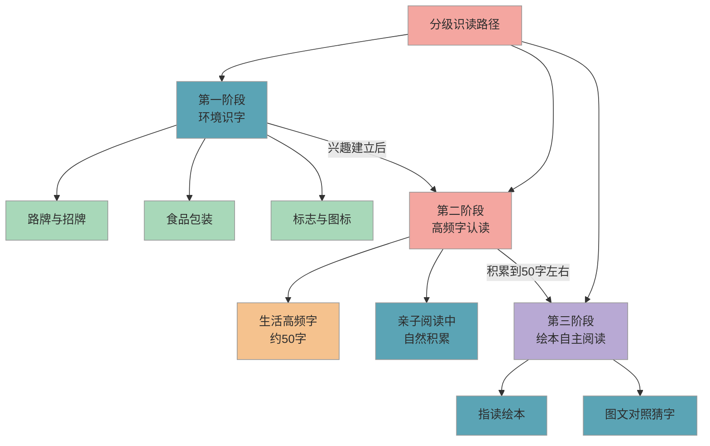

# 基础汉字分级识读

> 入学前认识 50-100 个生活中的高频字就是很好的基础，不需要追赶"别人家孩子认 500 字"的传说。

## 1. 知识点概述

**识字量**是幼小衔接阶段家长焦虑排名第一的话题。你大概在社群里见过这样的说法："入学前至少认识 500 个字，否则跟不上。"这个数字并没有任何课标依据，是培训机构和社交媒体层层放大后的误传。

真实情况是：2022 版新课标要求**一年级上学期会认约 300 个常用字、会写约 100 个字**。注意，这是一整个学期的目标，不是入学第一天的门槛。课标同时明确指出"不宜要求幼儿提前学写字"。

所以，入学前你需要帮孩子做的不是"认够多少字"，而是**让孩子对文字不陌生、对阅读有兴趣**。认识 50-100 个生活中常见的高频字（比如"大""小""上""下""人""口"），就已经是非常扎实的基础了。

## 2. 核心内容

### 2.1 课标实际要求

先来看清课标的真实数据，消除焦虑源头：

| 阶段 | 会认（识读） | 会写 | 说明 |
|------|-------------|------|------|
| 入学前 | 无硬性要求 | 不要求 | 课标明确"不宜要求幼儿提前学写字" |
| 一年级上学期 | 约 300 字 | 约 100 字 | 一整个学期的目标，循序渐进 |
| 一年级下学期 | 累计约 550 字 | 累计约 250 字 | 在上学期基础上增加 |
| 一二年级合计 | 约 1600 字 | 约 800 字 | 两年完成，不需要抢跑 |

**关键区分**：**会认**是指看到这个字能读出来，**会写**是指能正确书写。入学前只需要在"会认"层面做一些启蒙，完全不需要练写字。

### 2.2 分级识读路径

下图展示从零基础到自主阅读萌芽的三个阶段，每个阶段自然过渡、不需要刻意赶进度：

**解读**：三个阶段不是严格的先后关系，实际操作中会有大量重叠。环境识字从孩子会说话就可以开始，高频字认读在入学前半年到一年逐步渗透，绘本自主阅读是水到渠成的结果，不是需要"训练"的目标。

### 2.3 三个阶段详解

#### 2.3.1 第一阶段：环境识字（随时随地）

这是最自然、最不像"学习"的识字方式。孩子每天都在接触大量文字信息，你要做的只是偶尔指给 ta 看：

- **路牌与招牌**：超市的"出口""入口"，马路上的"停"，商店名称中的简单字
- **食品包装**：牛奶盒上的"牛""奶"，零食袋上的"大""小"
- **标志与图标**：男女卫生间的"男""女"，电梯里的"开""关"

这个阶段的核心不是"学会多少字"，而是让孩子意识到**文字是有意义的符号**，它们代表着具体的事物和信息。

#### 2.3.2 第二阶段：高频字认读（入学前 6-12 个月）

在环境识字的基础上，可以有意识地帮孩子认识一些生活中出现频率最高的字。以下是建议优先认识的高频字分组：

| 分组 | 示例 | 来源场景 |
|------|------|----------|
| 人称与称呼 | 人、大、小、我、你 | 日常对话 |
| 方位与动作 | 上、下、左、右、来、去 | 生活指令 |
| 自然与身体 | 日、月、水、火、口、手、目 | 绘本和儿歌 |
| 数字相关 | 一、二、三、四、五、十 | 数数和购物 |
| 生活常见 | 中、天、地、不、了、是 | 亲子阅读 |

建议入学前认识 **50-100 个**这类高频字即可。不需要每个字都反复默写测试，孩子在不同场景中多次"遇见"同一个字，自然就记住了。

#### 2.3.3 第三阶段：绘本自主阅读萌芽（顺其自然）

当孩子积累了 50 个左右的认读量后，你会发现 ta 开始在读绘本时主动"认字"了——看到认识的字会兴奋地指出来。这就是自主阅读的萌芽，顺势引导即可：

- 选择**字大、图多、重复句式**的绘本（如"好饿的毛毛虫""棕色的熊你在看什么"）
- 用**指读**的方式念给孩子听：手指点着文字，一个字一个字地读
- 鼓励孩子**猜字**：遮住图片问"这个字是什么"，或遮住文字问"你觉得这里写了什么"

## 3. 学习方法

### 3.1 生活识字法

把识字融入日常场景，不需要专门"上课"：

- 逛超市时让孩子帮忙找商品："帮我找写着'牛奶'的那个"
- 坐公交/地铁时一起读站名
- 做饭时让孩子辨认调料瓶上的字
- 收快递时一起看收件人名字

### 3.2 亲子阅读识字法

每天 15-20 分钟的**亲子阅读**是最高效的识字途径。不是让孩子自己认字读书，而是你读给 ta 听的同时，偶尔指着某个字问一问：

- "这个字我们昨天在超市见过，你还记得吗？"
- "这个'大'字长什么样？下次看到你能认出来吗？"

关键原则：**阅读的乐趣永远排在识字目标前面**。如果孩子不想认字只想听故事，那就安心讲故事。

### 3.3 字卡游戏法

把认识的字做成卡片，用游戏的方式巩固（适合 4 岁以上）：

- **配对游戏**：两张一样的字卡扣着放，翻开配对
- **寻宝游戏**：把字卡藏在家里各处，找到一张读一张
- **故事接龙**：抽一张字卡，用这个字说一句话

注意：每次玩 5-10 分钟即可，**绝不搞成默写测试**。孩子觉得好玩才会主动要求"再玩一次"。

## 4. 亲子互动建议

### 4.1 易错点

- ❌ 每天让孩子坐在桌前用字卡"过关"，认不出就反复教 → ✅ 把识字融入游戏和生活场景，孩子在真实语境中反复"遇见"一个字，比机械重复有效得多。如果孩子表现出抵触，立刻停下来——保护兴趣比多认几个字重要一百倍
- ❌ 入学前要求孩子学写字，买田字格本每天练习 → ✅ 课标明确"不宜要求幼儿提前学写字"。幼儿手部精细动作尚未发育完善，过早写字容易养成错误的握笔姿势和笔顺习惯，入学后反而要花更多时间纠正
- ❌ 以"别人家孩子认 500 字"为目标倒逼孩子 → ✅ 课标一年级上学期会认目标是约 300 字，入学前认识 50-100 个高频字就是很好的基础。识字不是竞赛，节奏因人而异

### 4.2 实操建议

1. **从今天开始"随手指字"**：出门时看到招牌、路牌，随口念给孩子听。不用刻意教，就是让文字进入孩子的视野，一天指 3-5 个就够了
2. **固定亲子阅读时间**：每天睡前 15 分钟读一本绘本，用手指着文字读。选孩子喜欢的书，不要选"识字教材"。坚持一个月，你会发现孩子开始主动指着书上的字问"这是什么"
3. **制作"我认识的字"墙**：在家里贴一张大纸，孩子每认识一个新字就写上去（你来写，孩子来读）。可视化的成就感会激发孩子主动认字的动力
4. **用生活场景复习**：孩子在绘本中认识了"大"字，下次看到"大白兔奶糖"时问 ta："这个字你认识吗？"跨场景复现是最有效的记忆巩固方式
5. **不测试、不打分**：永远不要问孩子"昨天教你的字还记得吗"。如果 ta 忘了，没关系——下次再遇到时自然会重新认识。识字是一个螺旋上升的过程，不是线性进度条

### 4.3 常见问题

**Q：入学前到底要认多少字？**
课标对入学前没有硬性识字量要求。一年级上学期的目标是会认约 300 字、会写约 100 字，这是一整个学期（4-5 个月）的教学目标，不是入学门槛。入学前能认识 50-100 个生活中的高频字，就已经是很好的基础了。"入学前要认 500 字"这个说法没有任何课标依据，请放心忽略。

**Q：孩子 5 岁了还不认识几个字，会不会太晚？**
完全不晚。大部分孩子在 4-6 岁之间才开始对文字产生兴趣，这是正常的发育规律。你需要做的不是着急教字，而是通过亲子阅读和环境识字让孩子感受到"文字是有用的、有趣的"。兴趣一旦被点燃，识字速度会非常快。

**Q：要不要买识字 APP 或识字课？**
如果孩子感兴趣，可以作为辅助工具，但不能替代亲子阅读和生活识字。APP 的优势是动画和互动性强，孩子容易被吸引；局限是缺少真实语境，孩子可能"在 APP 里认识，到生活中不认识"。建议每天使用不超过 15 分钟，且始终把亲子阅读作为识字的主要途径。

## 5. 相关推荐

| 推荐内容 | 说明 | 链接 |
|----------|------|------|
| 声母韵母分类与拼读 | 识字的工具：拼音 | [查看](声母韵母分类与拼读.md) |
| 亲子阅读指导 | 在阅读中自然认字 | [查看](亲子阅读指导.md) |

[← 返回 K0 目录](../../README.md)

---

*最后更新：2026-03-06*

---

> 本资料基于公开知识点整理，仅供个人学习参考。如有侵权请联系删除。
