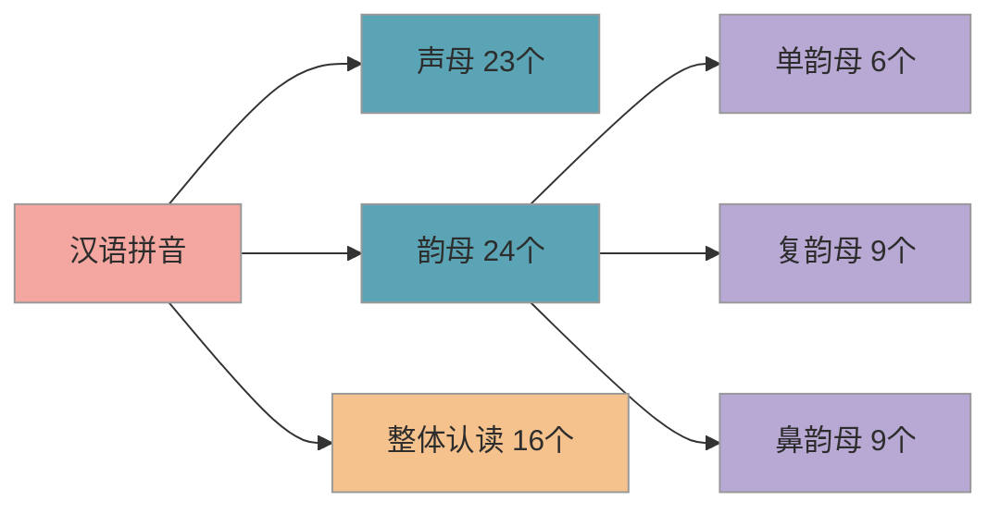
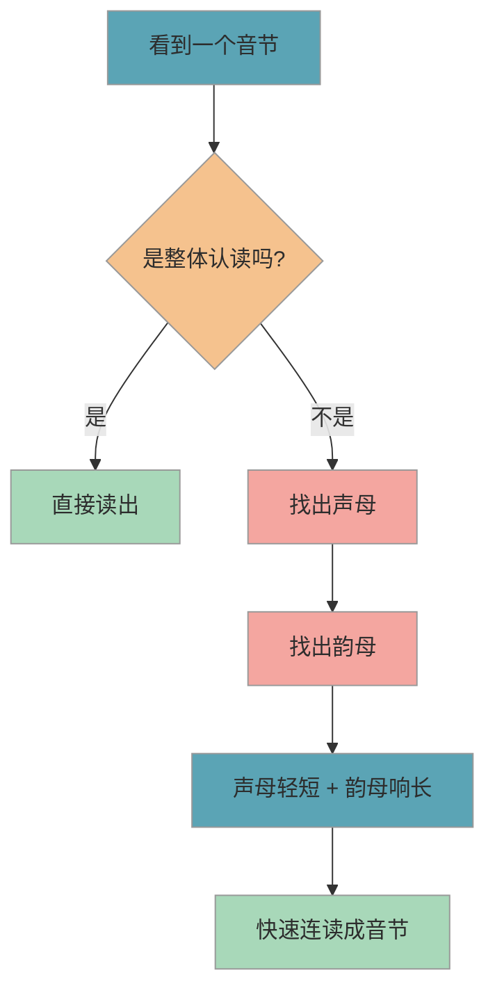

# 声母韵母分类与拼读

> 拼音是语文学习的第一道关卡。帮孩子理清声母、韵母、整体认读音节三大分类，拼读就不再是难题。

## 1. 知识点概述

**拼音**是小学语文的基础工具——认字、查字典、学普通话都离不开它。课标要求一年级上册完成拼音的系统学习，大约用两个月时间。很多家长听说"拼音一个月就讲完"会特别紧张，其实课标安排的时间是充裕的，孩子感觉吃力的根本原因往往是分类没理清，声母韵母混在一起死记硬背。

如果你能在孩子入学前帮他把拼音的"骨架"搭起来——知道什么是声母、什么是韵母、怎么拼到一起——一年级的拼音学习会轻松很多。这个阶段不需要追求"全部学完"，重点是**建立分类意识**和**感受拼读方法**。

## 2. 核心内容

### 2.1 拼音三大分类

汉语拼音由三大类组成：**声母**（23 个）、**韵母**（24 个）和**整体认读音节**（16 个）。下图展示拼音的完整分类体系：

**解读**：声母是"起头的辅音"，韵母是"跟在后面的元音部分"，整体认读音节则是固定搭配、看到直接读、不用拆开来拼的特殊音节。

### 2.2 声母（23 个）

声母可以按**发音部位**分成几组来记忆，比一个一个死记要轻松得多：

| 分组 | 声母 | 记忆提示 |
|------|------|----------|
| 唇音 | b p m f | 嘴唇用力的音 |
| 舌尖中音 | d t n l | 舌尖抵住上牙龈 |
| 舌根音 | g k h | 舌根抬起来 |
| 舌面音 | j q x | 舌面贴近上颚 |
| 舌尖前音（平舌） | z c s | 舌尖抵住上齿背 |
| 舌尖后音（翘舌） | zh ch sh r | 舌头卷起来 |
| 特殊 | y w | 可看作韵母 i、u 的"大写" |

> **提示**：不必让孩子背"舌尖中音""舌根音"这些名称，用分组的方式帮他发现"这几个音嘴巴动作差不多"就够了。

**容易混淆的声母**：

- **b 和 d**：镜像对称，是学前阶段最常见的混淆
- **p 和 q**：同样镜像对称，和 b/d 一起构成"四兄弟"
- **z c s 和 zh ch sh**：平舌音和翘舌音，发音部位不同

### 2.3 韵母（24 个）

韵母分三小类：

- **单韵母**（6 个）：a o e i u ü —— 最基础，一个字母一个音
- **复韵母**（9 个）：ai ei ui ao ou iu ie üe er —— 两个或三个字母组合发音
- **鼻韵母**（9 个）：an en in un ün ang eng ing ong —— 带鼻音的韵母

其中，**单韵母是基础中的基础**。建议先让孩子熟练掌握 6 个单韵母，再逐步学习复韵母和鼻韵母。

**容易混淆的韵母**：

- **前鼻音和后鼻音**：an-ang、en-eng、in-ing，是很多孩子（甚至大人）的难点
- **u 和 ü**：小 ü 头上的两点容易被忽略，尤其在 j q x 后面两点省略时更容易混淆

### 2.4 整体认读音节（16 个）

整体认读音节是需要"打包记忆"的音节，不需要拆开来拼。可以按组记忆：

| 分组 | 音节 | 记忆关联 |
|------|------|----------|
| 翘舌组 | zhi chi shi ri | 对应声母 zh ch sh r |
| 平舌组 | zi ci si | 对应声母 z c s |
| i u ü 组 | yi wu yu | 对应韵母 i u ü |
| 特殊组 | ye yue yuan | 含 üe、ü 的变形 |
| 鼻音组 | yin yun ying | 常见音节 |

你可以告诉孩子："这 16 个是'整体打包'的，看到就直接读，不用拆开拼。"

### 2.5 拼读基本方法

拼读的核心公式很简单：**声母 + 韵母 = 音节**。

具体操作分三步：

1. 先读声母（读得**轻、短**）
2. 再读韵母（读得**响、长**）
3. 快速连读，合成一个音节

例如：b + a = ba（爸）、m + a = ma（妈）、h + ao = hao（好）。

下图展示遇到一个音节时的拼读判断流程：

## 3. 学习方法

### 3.1 分组记忆法

不要一次把 23 个声母全教给孩子。每次学 3-5 个，按发音相近的分组来学。比如先学 b p m f 这组唇音，孩子会发现"这几个都是嘴唇用力"，找到规律后记起来快得多。等这组稳定了，再学下一组。

### 3.2 对比辨音法

把容易混淆的音放在一起对比，让孩子感受差异：

- **平舌 vs 翘舌**：z-zh、c-ch、s-sh，让孩子把手放在嘴前感受气流，或者摸下巴感受舌头位置的不同
- **前鼻音 vs 后鼻音**：an-ang、en-eng、in-ing，前鼻音嘴巴开口小、收音快，后鼻音嘴巴张得更大、鼻腔共鸣明显

### 3.3 生活拼读法

用生活中的物品随时练习拼读，让拼音"活"起来，而不只是纸上的字母：

- 吃饭时：mǐ fàn（米饭）、kuài zi（筷子）
- 出门时：qì chē（汽车）、hóng lǜ dēng（红绿灯）
- 睡前：gù shi（故事）、zhěn tou（枕头）

不需要刻意安排"上课时间"，日常生活中随口带一带，效果反而更好。

## 4. 亲子互动建议

### 4.1 易错点

- ❌ b 和 d 镜像混淆，写反、读反 → ✅ 用"左拳 b 右拳 d"口诀：左手握拳拇指朝上像 b，右手握拳拇指朝上像 d，随时可以伸手验证
- ❌ 前鼻音 an/en 和后鼻音 ang/eng 分不清 → ✅ 夸张发音让孩子感受：前鼻音嘴巴小、发音短促，后鼻音嘴巴大、发音拖长，对比着练更容易区分
- ❌ 整体认读音节当成拼读音节来拼（比如把 yi 拆成 y-i 来拼） → ✅ 明确告诉孩子"这 16 个是整体记住的，不用拆开"，可以做一套专门的绿色卡片标记出来
- ❌ 把 ü 上面的两个点忘掉，和 u 混淆 → ✅ 编口诀"小 ü 见了 j q x，擦掉眼泪笑嘻嘻"（去掉两点还念 ü），帮助孩子记住这个特殊规则

### 4.2 实操建议

1. **制作分色拼音卡片**：声母用蓝色卡片、韵母用粉色卡片、整体认读用绿色卡片，颜色分类帮助建立分类意识。卡片大小建议扑克牌尺寸，方便小手抓握
2. **每天 10 分钟拼音游戏**：随机抽卡片，孩子读出来并说是声母还是韵母；或者抽一张声母一张韵母，试着拼在一起——像"拼音接龙"一样玩
3. **物品拼读练习**：指着家里的东西说"杯子的'杯'，b-ēi-bēi"，先让孩子听你拼，再鼓励他自己试。从简单的两拼音节开始
4. **控制节奏，不贪多**：每次 3-5 个新内容，学会了再加。一周能稳定掌握一组声母或韵母就是很好的进度，完全不用着急
5. **鼓励为主，允许反复**：拼音学习是个反复的过程，今天忘了昨天学的很正常。不要因此批评孩子，多说"你比上次读得好"比"怎么又忘了"有效得多

### 4.3 常见问题

**Q：孩子入学前必须学完所有拼音吗？**

不必。入学前能区分声母和韵母、会简单的两拼音节（比如 ba、ma）就够了。一年级上册会用大约两个月系统教拼音，入学前打个基础、建立分类意识即可，不用追求 63 个拼音全部掌握。

**Q：用拼音 APP 学习效果好吗？**

可以作为辅助，但不能替代亲子互动。APP 练的是识别和选择，亲子互动练的是真实发音和生活中的运用，两者配合效果最好。建议 APP 时间每天不超过 15 分钟，关键是要有大人在旁边听孩子的发音是否准确。

**Q：孩子总是把 b d p q 搞混怎么办？**

这在学前阶段非常常见，和孩子的空间方位感发育有关，不必过于焦虑。可以用"拳头法"辅助记忆（握拳比出字母形状），也可以用身体动作强化（比如向左转是 b，向右转是 d）。随着练习增多和年龄增长，绝大多数孩子都能自然区分。

## 5. 相关推荐

| 推荐内容 | 说明 | 链接 |
|----------|------|------|
| 基础汉字分级识读 | 拼音之后学认字 | [查看](基础汉字分级识读.md) |
| 亲子阅读指导 | 在阅读中巩固拼音 | [查看](亲子阅读指导.md) |

[← 返回 K0 目录](../../README.md)

---

*最后更新：2026-03-06*

---

> 本资料基于公开知识点整理，仅供个人学习参考。如有侵权请联系删除。
