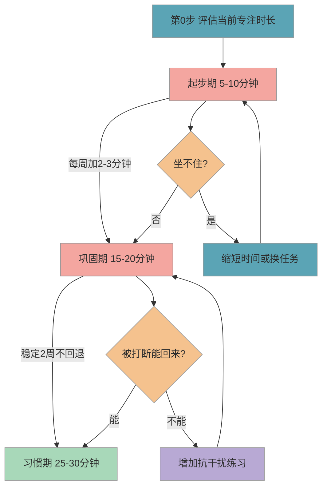

# 专注力训练方法

> 一年级课堂要求连续专注 35-40 分钟，而学龄前孩子有效专注时间约 10-15 分钟。这篇帮你用 3-6 个月时间，循序渐进地把孩子的专注时长拉上来——不焦虑、不抢跑，按节奏来就好。

## 1. 为什么重要

小学一节课 40 分钟，老师不会因为某个孩子走神而暂停。如果孩子坐不住、注意力容易跑，即使知识点都会，也可能因为"没听到老师在讲什么"而跟不上节奏。

《幼儿园入学准备教育指导要点》在"学习准备"维度明确提出，**"能专注、坚持完成一项任务"**是入学准备的关键发展目标之一。这意味着专注力不是"加分项"，而是课标认定的基本素质。

好消息是，**专注力不是天赋，是可以训练的能力**。4-5 岁孩子平均专注时间只有 10-15 分钟，这是正常发育水平，不是"有问题"。关键在于**循序渐进**——像练肌肉一样，从 5 分钟开始，每周加一点，3-6 个月就能拉到 25-30 分钟。

## 2. 目标画像

经过 3-6 个月的系统训练，孩子能够达到以下可观测的状态：

| 序号 | 目标描述 | 量化指标 |
|------|----------|----------|
| 1 | 安静坐在书桌前专注完成一项任务 | 连续 **25-30 分钟**不离开座位 |
| 2 | 被轻微干扰后能自行回到任务 | **1 分钟内**重新聚焦 |
| 3 | 听完一段故事后能复述关键内容 | 听 **5 分钟**故事，复述 **3 个以上**关键情节 |
| 4 | "书桌时间"内不主动切换活动 | 不要求看手机、看电视或换其他事做 |
| 5 | 能自发进入专注状态 | 到了固定时间段，**不需要提醒**即主动坐下 |

> 以上指标是训练终点的理想状态，每个孩子节奏不同，达到 3-4 项就已经很好了。

## 3. 分步培养方案

专注力训练分三个阶段，总周期约 3-6 个月。下图展示从起步到习惯化的完整路径：

### 3.1 第 0 步：评估当前水平（开始前 1-2 天）

在正式训练之前，先摸底。方法很简单：

1. 给孩子一项他喜欢的安静任务（拼图、涂色、积木等）
2. 不打扰、不提醒，用手机悄悄计时
3. 记录孩子**自然失去兴趣或离开座位**的时间
4. 测 2-3 次取平均值，这就是孩子的"基线专注时长"

拿到基线后，训练起点设为基线时长（而非一律从 5 分钟开始）。比如孩子基线是 8 分钟，那就从 8 分钟起步。

### 3.2 起步期（第 1-4 周）

**目标**：在基线基础上稳定输出，逐步拉到 10 分钟。

这个阶段的核心不是"让孩子学东西"，而是**建立"书桌时间"的仪式感**。

#### 3.2.1 固定时间和地点

每天同一时间、同一地点开始"书桌时间"。建议选上午精力最好的时段。固定的节奏会帮孩子建立预期——"到这个时间就是做这件事的"。

#### 3.2.2 选择有趣的单一任务

拼图、涂色、串珠、搭积木都可以，选孩子喜欢的。关键是**一次只做一件事**，桌面上只放当前任务的材料。

#### 3.2.3 使用可视化计时器

沙漏是最好的选择——孩子能"看到"时间在流动。从 5 分钟沙漏开始，告诉孩子"沙子漏完就可以休息"。

#### 3.2.4 结束时给具体反馈

不说"你真棒"，而说"你刚才专注了 6 分钟，比昨天多了 1 分钟"——**用数据说话**，让孩子感知到自己的进步。

### 3.3 巩固期（第 5-10 周）

**目标**：连续专注 15-20 分钟，被打断后能自行回来。

#### 3.3.1 逐步加时间

每周增加 2-3 分钟，不贪多。如果某周孩子状态不好（生病、情绪波动），保持上周时长不加，甚至可以适当回退。**允许波动，不强求直线上升**。

#### 3.3.2 任务升级

从纯娱乐（拼图、涂色）过渡到半学习任务（描红、听故事回答问题、按规则分类积木）。让孩子习惯"不是只有好玩的事才值得专注"。

#### 3.3.3 引入"听完再说"训练

读一段 3-5 分钟的故事，和孩子约定"听完再提问"。这模拟的是课堂场景——老师讲课时不能随时插嘴。读完后问 2-3 个问题，检验孩子是否真的在听。

#### 3.3.4 轻度抗干扰练习

孩子专注时，偶尔在旁边走动、轻声说话，观察是否能保持专注。如果能，给予具体表扬："刚才弟弟在旁边叫，你还是在画画，这就是专注"。

### 3.4 习惯期（第 11-24 周）

**目标**：连续专注 25-30 分钟，主动进入"书桌时间"，不需要家长提醒。

#### 3.4.1 模拟课堂节奏

25 分钟专注 + 5 分钟休息，循环 2 轮。这接近小学真实课堂节奏。休息时间可以喝水、走动、聊天，但不碰电子设备。

#### 3.4.2 任务多样化

交替安排不同类型任务（动手类 →听觉类 →书写类），训练"切换注意力后重新聚焦"的能力——课堂上每节课内容不同，孩子需要快速进入状态。

#### 3.4.3 逐步移交管理权

从"家长提醒开始"过渡到"孩子看到沙漏自己开始"，最终让孩子**自我管理**。你可以在前一天晚上和孩子一起准备第二天的"书桌材料"，让他对明天有期待。

#### 3.4.4 可视化成长记录

把每天的专注时长画成折线图贴在墙上。孩子能直观看到自己的进步曲线，这比任何口头表扬都有说服力。

## 4. 每日行动清单

### 4.1 日常安排

| 时间 | 行动 | 时长 | 要点 |
|------|------|------|------|
| 上午（固定时段） | "书桌时间"：拼图、涂色或描红 | 按阶段调整（5-30 分钟） | 沙漏计时，一次只做一件事，桌面只放当前材料 |
| 下午 | 亲子阅读 + 复述 | 10-15 分钟 | 读完问 2-3 个问题，练习"听完再说" |
| 傍晚 | 自由搭建或手工 | 10-15 分钟 | 不打断、不帮忙，让孩子独立完成 |
| 睡前 | 整理第二天的"书桌材料" | 5 分钟 | 培养准备习惯，顺便预告明天的任务 |

### 4.2 每周复盘

| 时间 | 行动 | 时长 | 要点 |
|------|------|------|------|
| 周末选一天 | 和孩子回顾本周专注时长记录 | 5-10 分钟 | 一起看折线图，聊"这周哪天最棒" |
| 周日 | 调整下周目标时长 | 5 分钟 | 根据表现决定加 2-3 分钟还是维持不变 |
| 周日 | 准备下周任务材料 | 10 分钟 | 更换新的拼图/涂色本，保持新鲜感 |

## 5. 效果检验

### 5.1 行为指标

用可观测的行为来判断每个阶段是否达标，而非"感觉孩子好像专注了"。

| 阶段 | 通过标准 | 观测方式 |
|------|----------|----------|
| 起步期结束 | 能独立专注 10 分钟，中途不离开座位 | 连续 3 天计时取平均值 |
| 巩固期结束 | 被轻微打断后 1 分钟内回到任务 | 故意制造轻度干扰（走过、开关门），观察反应 |
| 巩固期结束 | 听完 5 分钟故事能复述 3 个关键情节 | 讲完故事后自然提问 |
| 习惯期结束 | 到了"书桌时间"主动坐下，不需要提醒 | 连续 5 天观察，至少 4 天主动 |
| 习惯期结束 | 连续专注 25 分钟不切换活动 | 计时确认 |

### 5.2 易错点

很多家长在训练过程中会踩这些坑：

1. ❌ 一上来就要求孩子坐 30 分钟 →✅ 从 5 分钟开始，每周加 2-3 分钟，像练肌肉一样循序渐进
2. ❌ 训练时旁边开着电视、手机外放 →✅ 训练环境安静，桌面只放当前任务材料，手机静音收起
3. ❌ 孩子走神就批评"你怎么这么不专心" →✅ 温和提醒"我们继续"，结束后表扬坚持的部分
4. ❌ 用零食或看动画片"奖励"专注 →✅ 用具体的口头反馈（"你今天比昨天多了 3 分钟"）和成长记录作为激励
5. ❌ 只练"坐着不动"，不管做什么 →✅ 专注力训练的关键是"投入地做一件事"，不是"乖乖坐着"

### 5.3 实操建议

1. **今天就开始**：选一个固定时间段作为"书桌时间"，准备一个 5 分钟沙漏，从今天开始第一次练习。不需要等"准备好了"再开始。
2. **准备记录表**：画一张简单的表格贴在冰箱上，每天记录专注时长。让孩子亲手写数字或贴贴纸，这本身也是一种成就感。
3. **和孩子约定规则**：用孩子能理解的话解释——"沙子漏完之前，我们专心做一件事，漏完了就可以休息玩耍"。
4. **控制环境**：书桌上只放当前任务需要的东西，其他玩具、书本收到视线之外。环境越简洁，干扰越少。
5. **家长以身作则**：孩子"书桌时间"时，你也安静做自己的事（看书、工作），不刷手机——孩子会模仿你的状态。

### 5.4 常见问题

**Q：孩子确实坐不住，会不会是多动症？**

坐不住不等于多动症。4-5 岁孩子平均专注时间只有 10-15 分钟，这是正常发育水平。如果经过 2-3 个月系统训练完全没有改善，且伴有其他行为表现（如无法等待轮流、频繁冲动行为、在多个场景都无法安静等），**建议前往正规医院儿童发育行为科就诊**，由专业医生评估。请不要自行判断或听信网上的"自测量表"。

**Q：用平板上的"专注力训练"APP 有用吗？**

有一定辅助作用，但不能替代真实的"书桌任务"。平板靠声光刺激维持注意力，属于**被动专注**；而课堂是低刺激环境，需要的是**主动专注**。建议平板训练最多占总训练时间的 20-30%，主体还是靠实物任务来练。

**Q：男孩是不是比女孩更难坐住？**

整体上，同龄男孩的平均专注时间确实略短于女孩，但**个体差异远大于性别差异**。训练方法完全一样，只是起步时长可以根据孩子实际基线灵活调整，不必因为"是男孩"就降低最终目标。

## 6. 相关推荐

| 推荐内容 | 说明 | 链接 |
|----------|------|------|
| 握笔姿势与坐姿 | 专注力的下一步：正确坐姿 | [查看](握笔姿势与坐姿.md) |
| 书包整理与文具管理 | 培养自理能力 | [查看](书包整理与文具管理.md) |

[← 返回 K0 目录](../../README.md)

---

*最后更新：2026-03-06*

---

> 本资料基于公开知识点整理，仅供个人学习参考。如有侵权请联系删除。
