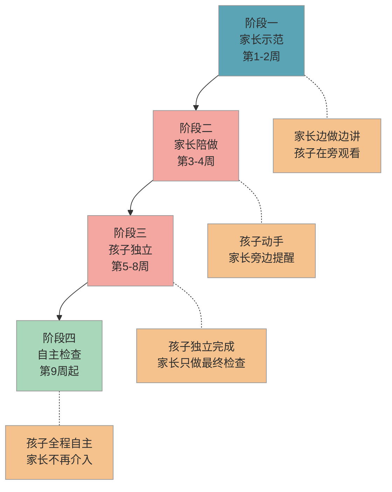

# 书包整理与文具管理

> 入学后"丢三落四"是家长最头疼的日常摩擦之一。这篇帮你在入学前用每天 5 分钟，把孩子的整理能力培养起来。

## 1. 为什么重要

一年级开学后，老师每天会布置不同科目的作业、要求带不同的学具。如果孩子不会自己整理书包，结果通常是：课本忘带、作业找不到、文具一周丢三支铅笔——而这些小事会不断消耗你和孩子的精力，甚至影响孩子在学校的自信心。

教育部《幼儿园入学准备教育指导要点》在"生活准备"维度明确要求孩子具备**整理物品、管理个人用品**的能力。这不是一个"锦上添花"的技能，而是入学基本功。

好消息是，整理能力完全可以在入学前训练出来。关键是**让孩子自己动手**，而不是家长每天代劳。

## 2. 目标画像

经过 2-3 个月的训练，孩子能达到：

- 能独立按课表把第二天需要的课本和文具装进书包，**全程不超过 5 分钟**
- 书包内物品**分区存放**（课本、文具、水杯各有固定位置），打开书包能在 **10 秒内**找到需要的东西
- 连续 **1 周**不丢失铅笔、橡皮等文具
- 不需要家长提醒，**主动**在固定时间整理书包

## 3. 分步培养方案

整理能力的培养需要一个从"家长带着做"到"孩子独立做"的渐进过程。下图展示四个培养阶段：

### 3.1 阶段一：家长示范（第 1-2 周）

**目标**：让孩子知道"整理书包"是什么样的流程。

你每天晚上在孩子面前整理书包，同时**说出你在做什么**：

- "我先看一下明天有哪些课……语文、数学、美术。"
- "语文课本放在课本区，彩色铅笔放在文具袋里。"
- "水杯放在侧袋，纸巾放在前面小口袋。"

让孩子在旁边看，不要求他动手。重点是让他理解"整理"是一个有步骤的过程，而不是随便往书包里塞东西。

### 3.2 阶段二：家长陪做（第 3-4 周）

**目标**：孩子开始动手，家长在旁边引导。

把主导权交给孩子："今天你来整理，我在旁边看。"当孩子遗漏或放错位置时，用**提问**代替直接纠正：

- "明天有美术课，你觉得还需要带什么？"
- "水杯放在哪里比较方便拿？"

这个阶段孩子会比较慢，可能要 10-15 分钟。**不要催**，不要嫌他慢而抢过来自己做。

### 3.3 阶段三：孩子独立（第 5-8 周）

**目标**：孩子独立完成整理，家长只做最终检查。

告诉孩子："你自己整理，整理完叫我，我帮你检查一下。"检查时如果发现遗漏，让孩子自己补上，而不是你帮他塞进去。

可以制作一张**整理检查清单**（贴在书桌旁）：

1. 看课表，找出明天的课
2. 课本放进课本区
3. 文具袋检查：铅笔、橡皮、尺子
4. 水杯放侧袋
5. 纸巾放前袋

### 3.4 阶段四：自主检查（第 9 周起）

**目标**：孩子不需要家长检查，全程自主完成。

当孩子连续 5 天独立整理且没有遗漏时，你可以告诉他："你已经很熟练了，以后不用我检查了，你自己搞定。"

偶尔抽查即可。如果发现又开始丢东西，不要批评，平静地回到阶段三即可。

## 4. 每日行动清单

| 时间 | 行动 | 时长 | 要点 |
|------|------|------|------|
| 晚饭后 | 对照课表整理书包 | 5 分钟 | 让孩子自己来，家长根据阶段决定介入程度 |
| 整理后 | 检查文具袋 | 1 分钟 | 铅笔是否削好、橡皮是否还在、尺子是否放回 |
| 每周日 | 文具盘点 | 3 分钟 | 清点铅笔、橡皮数量，补充消耗品 |
| 每周日 | 书包清洁 | 5 分钟 | 清理碎屑、检查水杯有无异味，培养爱惜物品意识 |

## 5. 效果检验

### 5.1 行为指标

| 阶段 | 通过标准 | 观测方式 |
|------|----------|----------|
| 示范期结束 | 能说出书包有几个分区、每个区放什么 | 口头提问 |
| 陪做期结束 | 在提醒下能完成整理，遗漏不超过 1 项 | 家长旁观记录 |
| 独立期结束 | 独立整理，连续 5 天无遗漏 | 家长抽查书包 |
| 自主期结束 | 连续 2 周不丢失文具，无需任何提醒 | 文具数量比对 |

### 5.2 易错点

- ❌ 嫌孩子慢，直接帮他整理完 → ✅ 每次都让孩子自己动手，宁可多花 5 分钟也不要代劳。代劳一时省事，但孩子永远学不会
- ❌ 孩子忘带东西就批评"你怎么又忘了" → ✅ 平静地引导复盘"我们一起看看是哪个步骤漏掉了"，帮助他完善流程而非制造挫败感
- ❌ 给孩子买一大堆花哨文具 → ✅ 文具简单实用即可。花哨文具容易分散注意力，也更容易弄丢。铅笔选素色的，橡皮选方块的

### 5.3 实操建议

1. **明天就开始**：今晚就在孩子面前整理一次书包，边做边说出每个步骤
2. **贴姓名贴**：给每一支铅笔、每一块橡皮都贴上姓名贴，丢了容易找回来。文具袋、水杯也要标注姓名
3. **制作整理清单**：用一张 A4 纸写上整理步骤（可以画简笔画），贴在书桌旁边，让孩子每天对照着做
4. **固定整理时间**：选一个每天固定的时间段（建议晚饭后），形成仪式感。固定时间比随机时间更容易养成习惯
5. **用"书包分区法"**：把书包内部划分为四个区域——课本区（主仓大格）、文具区（文具袋）、水杯区（侧袋）、杂物区（前袋放纸巾等），每样东西都有固定的"家"

### 5.4 常见问题

**Q：孩子总是丢铅笔，怎么办？**

很多家长都有这个烦恼，这是低年级最普遍的问题之一。建议你做三件事：一是每支铅笔贴姓名贴；二是每天晚上整理书包时清点铅笔数量（比如固定带 3 支）；三是和孩子约定"用完铅笔立刻放回文具袋"。不要一次性给太多铅笔，3-5 支足够，数量少反而更容易管理。

**Q：孩子不愿意自己整理，嫌麻烦怎么办？**

这很正常，尤其在阶段二刚开始让他动手的时候。建议你把整理过程变成一个小游戏——比如计时挑战"看看今天能不能比昨天快"，或者让他当"书包管理员"，给他一个专属的小头衔。关键是保持轻松的氛围，不要把整理变成一项"任务"或"惩罚"。

**Q：入学前没有课表，怎么练习整理书包？**

你可以模拟一张简单的课表。比如自己列一个"周一：语文、数学、美术"的模拟课表贴在墙上，让孩子根据这个来练习。用绘本代替课本、用画笔代替学具，重点是训练"看课表 → 找东西 → 分区放好"这个流程，而不是必须用真正的课本。

## 6. 相关推荐

| 推荐内容 | 说明 | 链接 |
|----------|------|------|
| 入学物品准备清单 | 先知道该买什么 | [查看](../practical/入学物品准备清单.md) |
| 专注力训练方法 | 整理也需要专注力 | [查看](专注力训练方法.md) |

[← 返回 K0 目录](../../README.md)

---

*最后更新：2026-03-06*

---

> 本资料基于公开知识点整理，仅供个人学习参考。如有侵权请联系删除。
