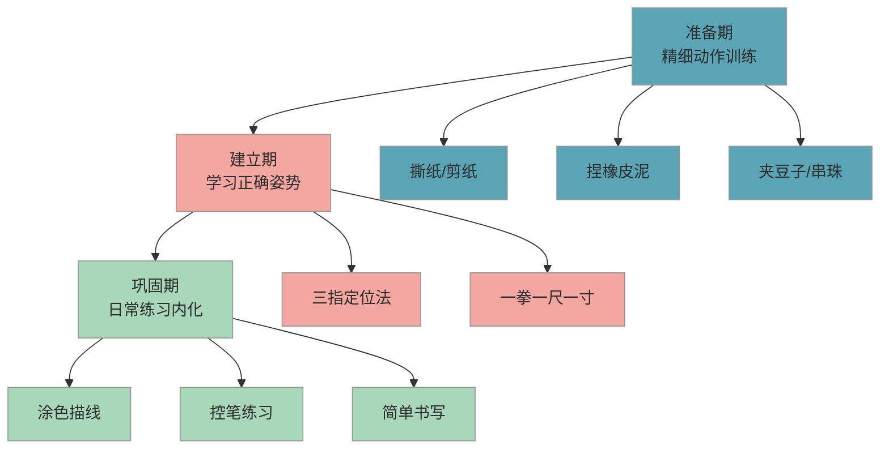

# 握笔姿势与坐姿

> 正确的握笔姿势和坐姿是书写的地基——地基歪了，楼越高越危险。这篇帮你在孩子正式写字之前，先把姿势准备好。

## 1. 为什么重要

一年级开始大量书写后，握笔姿势和坐姿几乎每天都在使用。错误姿势一旦固化，纠正成本极高——很多三四年级家长反馈"改了一年都没改过来"。

课标在"身心准备"维度明确要求**动作灵活**（精细动作发展良好，如握笔、剪纸）。注意，课标同时指出"不宜要求幼儿提前学写字"。所以我们的重点是：**先把姿势准备好，写字的事入学后自然水到渠成**。

错误握笔姿势的常见后果：

- 写字慢、手酸，作业耗时是其他孩子的 1.5-2 倍
- 手腕过度用力导致字迹歪扭、大小不一
- 坐姿歪斜引发近视风险增加（眼距书本过近）
- 孩子因为"写字不好看"产生挫败感，影响学习兴趣

## 2. 目标画像

经过 2-3 个月的姿势准备训练，孩子能达到：

- 用**三指定位法**正确握笔，保持 **3 分钟**不松动、不变形
- 坐在书桌前能自觉做到**一拳一尺一寸**（无需家长提醒）
- 能正确握笔完成 **5-10 分钟**的连续涂色或描线任务
- 被提醒姿势不对时，能在 **5 秒内**自行调整回正确姿势

## 3. 分步培养方案

下图展示握笔姿势与坐姿的三阶段培养路径：

### 3.1 准备期（第 1-3 周）：精细动作热身

这个阶段不需要拿笔。目标是让孩子的手指力量和灵活度达到握笔的基本要求。

**每天做 1-2 项，每项 5 分钟：**

- **撕纸/剪纸**：沿着线条撕或剪，训练拇指和食指的配合
- **捏橡皮泥**：揉圆、搓长条、捏小动物，增强手指力量
- **夹豆子**：用筷子或镊子把豆子从一个碗夹到另一个碗，训练三指协调
- **串珠子**：把小珠子串到绑带上，训练手眼协调和精细控制

> 这些活动对孩子来说就是"玩"，不需要刻意强调"这是训练"。

### 3.2 建立期（第 4-6 周）：学习正确姿势

#### 3.2.1 三指定位法

正确握笔的核心是**三个手指各司其职**：

- **拇指**：在笔杆左侧，指腹轻贴笔杆
- **食指**：在笔杆右上方，第一关节自然弯曲
- **中指**：在笔杆下方，用第一关节侧面托住笔杆
- **无名指和小指**：自然弯曲靠拢，作为支撑

**关键检查点：**

- 三指距笔尖约 **一寸（约 2-3 厘米）**
- 笔杆靠在食指第三关节处（虎口位置）
- 笔杆与纸面呈约 **45-60 度角**
- 手腕放松，不悬空也不死压在桌面上

建议你和孩子一起拿笔，用"我做你看、你做我看"的方式练习。每次练习前先检查一遍姿势，确认对了再开始。

#### 3.2.2 一拳一尺一寸

正确坐姿的口诀是**一拳一尺一寸**，你可以和孩子一起编成顺口溜：

| 口诀 | 含义 | 检查方法 |
|------|------|----------|
| **一拳** | 胸口距桌边一拳的距离 | 让孩子握拳放在胸口和桌边之间 |
| **一尺** | 眼睛距书本/纸面约一尺（33 厘米） | 大致是小臂的长度 |
| **一寸** | 手指距笔尖约一寸（2-3 厘米） | 大致是一个指节的长度 |

**配套环境准备：**

- 椅子高度：孩子坐下后双脚能平放在地面上
- 桌面高度：手肘自然放在桌上时，大臂与小臂约成 90 度
- 如果椅子太高，加一个脚踏板；桌子太高，加一个坐垫

### 3.3 巩固期（第 7-12 周）：日常练习内化

这个阶段的目标是让正确姿势变成"不用想就能做到"的自然状态。

#### 3.3.1 从涂色描线开始

- 选择大面积涂色本（A4 大小），让孩子用正确姿势涂色
- 从简单的直线描线开始，逐步过渡到曲线、波浪线
- 每次 **5-8 分钟**，不求速度，只求姿势保持正确

#### 3.3.2 控笔练习进阶

- **走迷宫**：用铅笔在迷宫中画路线，训练笔的控制力
- **连点成图**：按数字顺序连接点，训练笔画方向控制
- **画圆和画方**：从大到小画同心圆/方，训练手腕灵活度

#### 3.3.3 简单书写过渡

当孩子能正确握笔连续涂色 8 分钟以上时，可以尝试：

- 写自己的名字（1-3 个字即可）
- 描写简单的笔画（横、竖、撇、捺）
- 注意：**这不是提前学写字，是姿势的实战检验**

## 4. 每日行动清单

| 时间 | 行动 | 时长 | 要点 |
|------|------|------|------|
| 上午 | 精细动作游戏（剪纸/捏泥/夹豆子） | 5-10 分钟 | 准备期每天做，建立期后可隔天做 |
| 下午 | 握笔练习（涂色/描线/控笔） | 5-10 分钟 | 开始前先检查姿势，中途提醒一次 |
| 随时 | 姿势口诀复习 | 1 分钟 | 坐下吃饭或看书时顺带练习"一拳一尺一寸" |

**每周节奏建议：**

- 第 1-3 周：以精细动作游戏为主，每天 5-10 分钟
- 第 4-6 周：精细动作 + 握笔姿势学习，每天合计 10 分钟
- 第 7 周起：以握笔练习为主，每天 5-10 分钟

> 总时长控制在 **每天 10 分钟以内**。时间短没关系，关键是每天都做、姿势正确。

## 5. 效果检验

### 5.1 行为指标

| 阶段 | 通过标准 | 观测方式 |
|------|----------|----------|
| 准备期结束 | 能用筷子/镊子连续夹起 5 颗豆子 | 计时观察，不超过 2 分钟 |
| 建立期结束 | 三指定位法握笔保持 3 分钟不变形 | 握笔后计时，观察手指位置 |
| 建立期结束 | 坐下后 10 秒内自觉调整到一拳一尺一寸 | 不提醒，观察是否主动调整 |
| 巩固期结束 | 正确握笔连续涂色/描线 5-10 分钟 | 中途不提醒，看姿势是否走形 |

### 5.2 易错点

- ❌ 一开始就让孩子写字练姿势 → ✅ 先从涂色、描线开始，降低难度才能专注于姿势本身
- ❌ 每次姿势不对就立刻纠正，一分钟纠正三四次 → ✅ 每次练习最多提醒 2 次，过度纠正会让孩子厌烦甚至抵触拿笔
- ❌ 买了矫正握笔器就觉得万事大吉 → ✅ 握笔器只是辅助，关键是孩子理解三指的正确位置，逐步脱离辅助工具

### 5.3 实操建议

1. **明天就开始**：找一把剪刀和一张废纸，让孩子沿着折痕剪——这就是精细动作训练的第一步
2. **准备合适的笔**：初学阶段选择**三角杆铅笔**（HB 或 2B），笔杆的三个面自然引导三指定位
3. **和孩子一起练**：你拿一支笔，孩子拿一支笔，互相检查姿势——这比单方面"教"有效得多
4. **用口诀帮助记忆**：把"一拳一尺一寸"编成节奏感强的顺口溜，吃饭坐下时也能顺带练习坐姿
5. **拍照记录进步**：每周拍一张孩子握笔的照片，一个月后对比给孩子看——可视化的进步是最好的激励

### 5.4 常见问题

**Q：孩子左手握笔，需要纠正成右手吗？**

不需要强制纠正。左手握笔是正常的，强制换手反而可能造成书写困难和心理抵触。三指定位法左手同样适用（镜像即可）。如果孩子左右手都还没有明确偏好，可以引导用右手，但不要强迫。

**Q：握笔器有用吗？值得买吗？**

握笔器对初学阶段有一定辅助作用，尤其是帮助孩子快速找到三指的正确位置。建议选择**凹槽式三指握笔器**，价格在 5-15 元即可。但要注意，握笔器是过渡工具，目标是逐步脱离。使用 2-4 周后尝试去掉，看孩子能否保持正确姿势。

**Q：孩子嫌练习无聊不想做怎么办？**

很多家长都会遇到这个问题。建议把练习融入游戏场景：涂色选孩子喜欢的卡通形象，描线设计成"帮小兔子找到胡萝卜"的故事线，夹豆子变成"看谁夹得多"的比赛。另外，**每天 5 分钟足够**，千万不要因为"想多练一会"而拖到 20 分钟——短时高频比长时低效好得多。

## 6. 推荐好物

> 以下链接为推荐链接，通过链接购买可为本项目提供微小支持。所有推荐均为京东自营商品，不推荐无需强买。

- [得力洞洞铅笔 HB 三角杆](https://union-click.jd.com/jdc?e=618%7Cpc%7C&p=JF8BATIJK1olXwcBUlhdAE0SBV8PHF0dXQUDZBoCUBVIMzZNXhpXVhgcDBsJVFRMVnBaRQcLWgEEXF5eCVRORjNVKyFoWWZAXSQDbTxfQTlbRQEcGAVqHRhRBHsWM2wJGV0dWAcBVldtOEsQMy1mz9Szib2og_nr3P-R2tmTwvqBiqCkjefc3MCxM244G10TXwQLV1leDUwfAV8PG1IlClJfDBcKTnsnM2w4HFscSQBwFQxJDjknM284GGsVXAYDUVlVAUsWAXMIGF8cWwIeVFhbCkkeAGgIE1kWVDYAVV9ZAXsn3eK4Y1hcPWJ1VDgPVQBzVDEBZIWY7RdpLVZdCEgGMz1DWylRL317LgcaXC9CdihOfD5DBwZAXTBfCkxzBWtscz5vXwRQHw0eCRcnBl8KHV4SXjY) — 三角杆自然引导三指定位，HB 硬度适中
- [握笔矫正器（硅胶款）](https://union-click.jd.com/jdc?e=618%7Cpc%7C&p=JF8BAT8JK1olXgYLU1tfDEkSC18IGloWXgAAVllbAE8nRzBQRQQlBENHFRxWFlVPRjtUBABAQlRcCEBdCUoUAGkKGVwTVQIdDRsBVUVTXDdWRCdBCF5SMQ4LBEh5AgEIKyFJO1IcKwBbaDFxQy5DUzhyJk9wDhhRBHsWM2wJGV0dWAcBVldtOEsQMzlmG1oUXAcKXFpcC3sWM28OHVkXVAQAUFxeC0gnBG8BKwxBAF5LAxhtOHsUM2gIEk8TL0dQQFgvOHsXM2w4G1oVXAEBUV1cD0sLA20NGlIXQQYEUlxfAUkVBmYAHVolXwcDUFdtOJWasxkAUi52KltGKx4IQyJMQRDWlusEL3YLU1dcGXtkfyxIHTlDVQd6BykFaw1HSBxhaCNwO2JsVisqWDRNR24MGgF2PmJCXQgdOE4nAWkNHFgl) — 辅助矫正握姿，柔软硅胶不硌手

## 7. 相关推荐

| 推荐内容 | 说明 | 链接 |
|----------|------|------|
| 专注力训练方法 | 坐姿的前提：坐得住 | [查看](专注力训练方法.md) |
| 声母韵母分类与拼读 | 握好笔后开始写拼音 | [查看](../chinese/声母韵母分类与拼读.md) |

[← 返回 K0 目录](../../README.md)

---

*最后更新：2026-03-06*

---

> 本资料基于公开知识点整理，仅供个人学习参考。如有侵权请联系删除。
