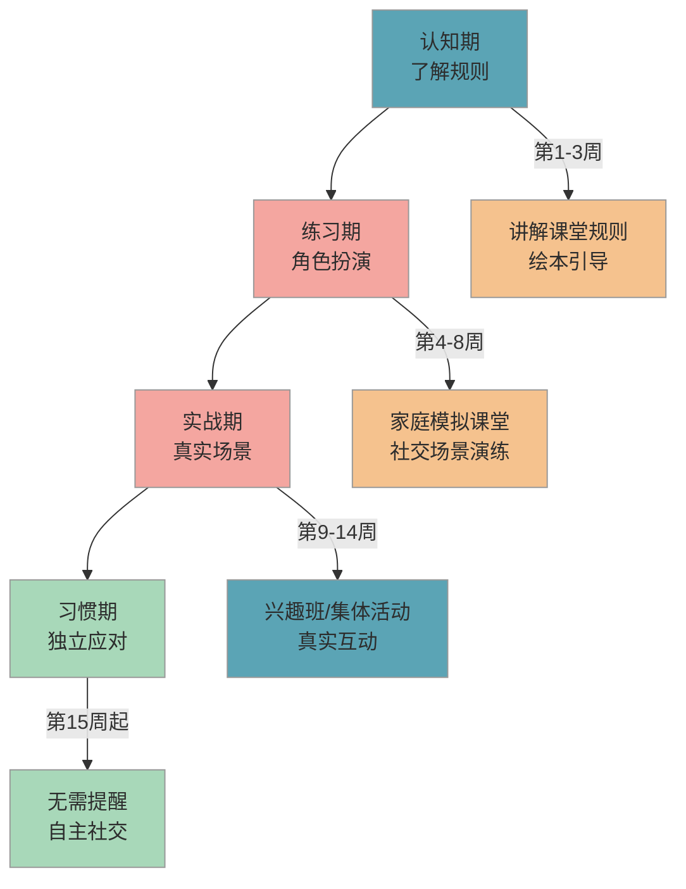

# 社交适应指南

> 从幼儿园到小学，社交环境变化巨大——课堂规则更严格、同伴关系更复杂。这篇帮你在入学前帮孩子做好社交准备，从容应对新环境。

## 1. 为什么重要

幼儿园里，孩子可以自由走动、随时找老师说话、和小伙伴边玩边聊。但小学课堂有明确规则：发言要举手，排队要等候，听讲时要安静。

很多家长担心"孩子内向，怕被欺负""不敢举手发言"。其实，**内向不是缺点**，内向的孩子往往观察力更强、思考更深入。关键不是改变孩子的性格，而是帮孩子掌握**适应新环境的基本社交技能**——知道规则是什么、遇到困难怎么求助、和同学怎么相处。

课标在"社会准备"维度明确要求四个方面：交往合作、诚实守规、任务意识、热爱集体。这些能力不需要"天生外向"，**每个孩子都可以通过练习掌握**。

## 2. 目标画像

经过 3-6 个月的引导和练习，孩子能达到以下状态：

- 知道课堂基本规则，能**连续 3 天以上**在课堂模拟中做到举手发言、安静听讲
- 遇到困难时（如找不到文具、不舒服），能**主动向老师说出自己的需求**，而非哭泣或沉默
- 和同伴玩耍时，能**完成至少 1 次协商**（如"我们轮流玩好不好"）
- 能用语言表达基本感受："我不开心，因为……""我想……可以吗？"
- 在陌生环境中（如新的兴趣班），能在 **2-3 次** 后自主参与集体活动

## 3. 分步培养方案

下图展示社交适应能力的三个培养阶段：

### 3.1 认知期：了解规则（第 1-3 周）

**目标**：让孩子知道小学课堂的基本规则，消除对"规则"的恐惧。

这个阶段不要求孩子"做到"，只要求"知道"。你可以通过以下方式帮孩子建立认知：

#### 3.1.1 绘本和故事引导

选择与上学相关的绘本，和孩子一起读。读完后聊一聊："故事里的小朋友上课时做了什么？""你觉得为什么要举手才能说话？"

推荐绘本方向（非指定书目）：关于入学适应、交朋友、课堂规则的绘本。

#### 3.1.2 观察与讨论

如果有机会参观小学或看到小学生活的视频，和孩子一起观察："你看，小朋友排队进教室""老师提问时，大家都举手了"。**用描述代替说教**，让孩子自己发现规则。

### 3.2 练习期：角色扮演（第 4-8 周）

**目标**：通过模拟场景，让孩子在安全的环境中反复练习社交技能。

#### 3.2.1 家庭模拟课堂

每周 2-3 次，和孩子玩"上课"游戏：

- 你当老师，孩子当学生（也可以互换角色）
- 练习举手发言、安静听讲、排队等候
- 每次 10-15 分钟，**不要追求完美**，重点是"玩起来"

#### 3.2.2 社交场景演练

针对孩子可能遇到的具体场景，提前"彩排"：

| 场景 | 演练内容 | 关键句式 |
|------|----------|----------|
| 想加入别人的游戏 | 走过去，礼貌询问 | "我可以和你们一起玩吗？" |
| 东西被拿走了 | 用语言表达，而非动手 | "这是我的，请还给我" |
| 不舒服/需要帮助 | 找到老师，说出需求 | "老师，我肚子疼/我找不到铅笔" |
| 被同学嘲笑 | 不过度反应，寻求帮助 | "我不喜欢你这样说，请不要了" |

#### 3.2.3 情绪表达练习

每天花 2-3 分钟和孩子做"情绪命名"练习。比如晚饭后聊一聊："你今天最开心的事是什么？有没有不开心的事？"帮孩子学会用语言描述感受，而不是用哭闹或沉默表达。

### 3.3 实战期：真实场景（第 9-14 周）

**目标**：在真实的集体环境中运用练习过的技能。

#### 3.3.1 创造社交机会

- 参加兴趣班、社区活动、小区儿童聚会
- 邀请 1-2 个小朋友到家里玩（**小范围比大群体更适合起步**）
- 让孩子在超市、餐厅等场景中自己向服务员表达需求

#### 3.3.2 观察与复盘

每次社交活动后，和孩子简单聊几句：
- "你今天和谁一起玩了？"
- "有没有遇到什么困难？你是怎么解决的？"
- **不评判**，只倾听和鼓励

### 3.4 习惯期：独立应对（第 15 周起）

**目标**：孩子能在多数社交场景中独立应对，家长逐步退出。

到这个阶段，你应该观察到孩子开始自主处理简单的社交问题。你的角色从"教练"变为"后盾"——孩子知道遇到搞不定的事可以找你，但日常社交不再需要你介入。

## 4. 每日/每周行动清单

| 时间 | 行动 | 时长 | 要点 |
|------|------|------|------|
| 每天·晚饭后 | 情绪对话：聊今天的开心事和不开心事 | 5 分钟 | 不评判，只倾听，帮孩子命名情绪 |
| 每周 2-3 次 | 家庭模拟课堂/角色扮演 | 10-15 分钟 | 轮流当老师和学生，游戏化进行 |
| 每周 1 次 | 社交场景演练：练习 1 个具体场景 | 5-10 分钟 | 从上方场景表中选择，反复练习关键句式 |
| 每周 1-2 次 | 真实社交活动：小区玩耍/兴趣班 | 30-60 分钟 | 鼓励孩子主动参与，活动后简单复盘 |
| 每周末 | 亲子阅读：选一本社交主题绘本 | 15 分钟 | 读完讨论"如果是你会怎么做" |

## 5. 效果检验

### 5.1 行为指标

| 阶段 | 通过标准 | 观测方式 |
|------|----------|----------|
| 认知期结束 | 能说出 3 条以上课堂规则 | 问孩子"上课时要怎么做" |
| 练习期结束 | 角色扮演中能主动举手、等待轮流 | 模拟课堂中观察，连续 3 次做到 |
| 实战期结束 | 在真实场景中主动向 1 个陌生小朋友发起对话 | 在公园/兴趣班中观察 |
| 习惯期结束 | 遇到社交困难时用语言表达而非哭闹 | 连续 2 周无需家长介入处理同伴冲突 |

### 5.2 易错点

- ❌ 给孩子贴标签"你太内向了""你怎么不敢说话" → ✅ 描述行为而非定性："我注意到你今天没有和小朋友打招呼，下次我们可以试试先说'你好'"
- ❌ 替孩子社交，帮孩子抢回玩具、代替孩子向老师说话 → ✅ 在旁边引导，让孩子自己开口："你可以告诉小朋友，你想先玩，等一下换他"
- ❌ 逼孩子在大人面前"表演"——强迫叫人、当众背诗 → ✅ 在孩子感到安全的环境中自然练习，不设"表演"场景

### 5.3 实操建议

1. **今天就开始**：晚饭时和孩子聊"今天最开心的事"，建立每日情绪对话的习惯
2. **准备一个"社交百宝箱"**：把常用句式写在卡片上（"我可以一起玩吗？""请不要这样"），贴在家里显眼处，随时练习
3. **从 1 个好朋友开始**：不要急于让孩子"交一群朋友"。帮孩子在小区或幼儿园找到 1 个玩得来的小伙伴，定期约着一起玩，**稳定的友谊比广泛的社交更重要**
4. **用"我"开头的句式教孩子表达**：教孩子说"我觉得……""我想要……""我不喜欢……"，而不是"你为什么抢我的""你真讨厌"。**"我"句式表达感受，"你"句式制造冲突**
5. **做孩子的"安全基地"**：告诉孩子"如果在学校遇到搞不定的事，回来告诉爸爸妈妈，我们一起想办法"。孩子知道有退路，反而更敢往前走

### 5.4 常见问题

**Q：孩子特别内向，完全不敢和陌生人说话，是不是社交障碍？**

内向和社交障碍是两回事。内向的孩子可能需要更多时间观察和适应，但并不意味着有问题。大多数孩子在熟悉环境后都能正常社交。如果孩子在**所有环境中**（包括家里、和熟悉的人在一起时）都极度回避社交，持续 6 个月以上且明显影响日常生活，建议咨询专业的儿童心理医生，不要自行判断。

**Q：孩子在幼儿园被其他小朋友"欺负"了，该怎么处理？**

首先区分"冲突"和"欺负"。学龄前孩子之间的推搡、抢玩具大多是社交技能不成熟的表现，不等于"校园欺凌"。你可以教孩子三步应对法：**第一步**，大声说"不要这样，我不喜欢"；**第二步**，走开，离开冲突现场；**第三步**，告诉老师或家长。如果情况反复发生且孩子情绪明显受影响，需要和老师沟通了解具体情况。

**Q：孩子在家很活泼，到了外面就"变了个人"一样，正常吗？**

完全正常。这说明孩子能区分"安全环境"和"陌生环境"，是一种正常的自我保护机制。你需要做的不是逼孩子在外面也"活泼"，而是帮孩子**逐步扩大"安全环境"的范围**——先在熟悉的小朋友面前放松，再慢慢适应更大的社交圈。急于求成反而会让孩子更退缩。

## 6. 相关推荐

| 推荐内容 | 说明 | 链接 |
|----------|------|------|
| 开学第一周生存指南 | 社交能力在第一周最关键 | [查看](../practical/开学第一周生存指南.md) |
| 专注力训练方法 | 课堂专注是社交的基础 | [查看](专注力训练方法.md) |

[← 返回 K0 目录](../../README.md)

---

*最后更新：2026-03-06*

---

> 本资料基于公开知识点整理，仅供个人学习参考。如有侵权请联系删除。
