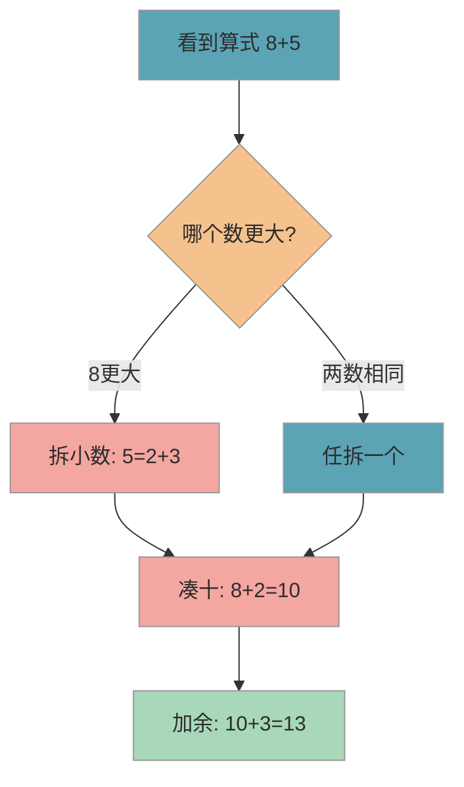
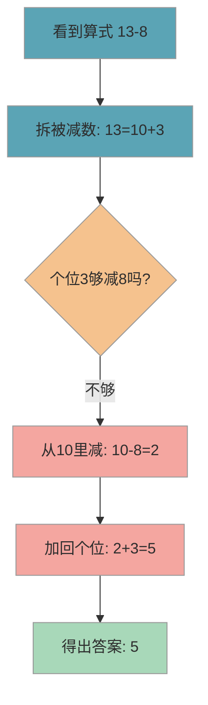
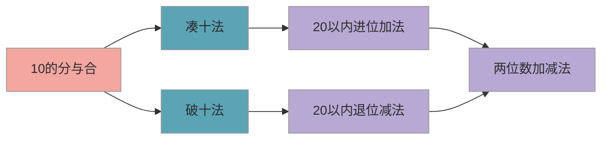

# 凑十法与破十法

> 凑十法和破十法是 20 以内加减法的两大核心方法，入学前有基础会让一年级数学更轻松，但不要求完全掌握——重在理解思路，而非追求速度。

## 1. 知识点概述

**凑十法**是做加法时，把其中一个数拆开，凑成 10 再算；**破十法**是做减法时，先从 10 里减，再把剩余的数加回来。

课标要求一年级掌握 20 以内的加减法，而凑十法和破十法正是实现这个目标的核心方法。它们也是后续"进位加法"和"退位减法"的底层逻辑。如果你发现孩子算 20 以内的题经常出错、速度很慢，或者一直依赖掰手指，大概率就是这两个方法没有练到位。

不过请放心：K0 阶段的目标是**让孩子理解思路、建立感觉**，不需要做到又快又准。入学后老师会系统教授，你现在要做的是帮孩子打好"10 的分与合"这个地基。

## 2. 核心内容

### 2.1 前置基础：10 的分与合

在学凑十法和破十法之前，孩子需要先熟悉 **10 的分与合**——也就是哪两个数加起来等于 10。一共只有 5 组：

- 1 和 9
- 2 和 8
- 3 和 7
- 4 和 6
- 5 和 5

这是凑十法和破十法的"原材料"。如果孩子对这 5 组还不熟，建议先花几天专门练这个，再往下走。

### 2.2 凑十法（加法）

凑十法的核心思路是"看大数、拆小数、先凑十、再加余"。具体来说，就是把较小的那个数拆成两部分，其中一部分和较大的数凑成 10，然后再加上剩下的部分。

下图展示凑十法的完整计算步骤（以 8+5 为例）：

**三步走口诀**：

1. **看大数**：找到两个数中较大的那个（8）
2. **拆小数**：想一想大数"还差几到 10"（8 差 2），把小数拆成 2 和 3
3. **凑十加余**：8+2=10，10+3=13

再看一个例子：7+6。7 还差 3 到 10，所以把 6 拆成 3+3，7+3=10，10+3=13。

### 2.3 破十法（减法）

破十法的核心思路是"不够减就找 10 借"。当个位不够减的时候，先从 10 里面减，再把个位的数加回来。

下图展示破十法的完整计算步骤（以 13-8 为例）：

**三步走口诀**：

1. **拆开**：把被减数拆成"10 + 几"（13 = 10 + 3）
2. **先减**：用 10 减去减数（10 - 8 = 2）
3. **再加**：把减出来的结果加上个位数（2 + 3 = 5）

再看一个例子：15-7。把 15 拆成 10+5，10-7=3，3+5=8。

### 2.4 两种方法的关系

凑十法和破十法其实是"一体两面"——凑十法是把数"凑到 10"，破十法是把数"从 10 里拆出来"。它们都围绕"10"这个核心数字展开，背后依赖的是孩子对 **10 的分与合** 的熟练程度。

下图展示两种方法的知识关系和进阶路径：

## 3. 计算技巧

掌握凑十法和破十法有一个前提条件：孩子必须对 **10 的分与合** 非常熟练。也就是说，看到任何一个 10 以内的数，能马上反应出"它还差几到 10"。

这里有几个实用的小技巧帮你训练孩子：

- **"差几"思维**：看到一个数，马上反应出"它还差几到 10"。比如看到 7，马上想到"差 3"。这个反应越快，凑十法就越顺畅
- **"对称"记忆**：10 的分与合是对称的——1+9、2+8、3+7、4+6、5+5，只需要记 5 组
- **从实物到抽象**：先用 10 格盒（两排各 5 格的盒子）摆积木，让孩子视觉上看到"凑满"和"拆开"的过程，再过渡到纯数字计算

### 3.1 易错点

- ❌ 拆数时随意拆，没有"凑 10"的意识（比如 8+5，把 5 拆成 1+4） → ✅ 先想"大数还差几到 10"，再拆小数（8 差 2，所以 5 拆成 2+3）
- ❌ 凑到 10 之后忘了加上剩余部分，直接写 10 → ✅ 养成"凑十、加余"两步口诀的习惯，每次让孩子说出完整过程
- ❌ 破十法中 10 减完后忘了加上个位数（13-8 只算了 10-8=2 就停了） → ✅ 分步写出来：第一步 10-8=2，第二步 2+3=5
- ❌ 凑十法和破十法混淆，做减法时也想着"凑" → ✅ 口诀区分：加法用"凑"（把数凑到 10），减法用"破"（从 10 里拆），加减分开练

### 3.2 实操建议

1. **先练"10 的分与合"**：用扑克牌玩"凑 10 配对"游戏——翻两张牌，加起来等于 10 就赢走，这是一切的基础
2. **用 10 格盒做可视化**：准备一个两排各 5 格的盒子和一些小积木，让孩子亲手摆出"凑满 10 格"和"从 10 格里拿走"的过程，建立直观感觉
3. **每天练习 5+5 道**：每天做 5 道凑十法 + 5 道破十法，不贪多，重在让孩子说出每一步的思考过程
4. **口头提问培养直觉**：随时随地问孩子"8 还差几到 10？""7 和几凑 10？"，让"差几凑十"变成条件反射
5. **出错时回溯过程**：不急着纠正答案，而是问孩子"你是怎么拆的"，找到卡住的那一步再针对性练习

### 3.3 常见问题

**Q：孩子掰手指算对了，还需要学凑十法吗？**

需要。掰手指在 10 以内够用，但到了 20 以内就不够用了（手指只有 10 根）。更重要的是，凑十法是"进位加法"的底层思维，后面学两位数加法（比如 28+15）时，本质上还是在用凑十的思路。越早建立这个思维模式，后面的路越顺。

**Q：凑十法和破十法要同时学吗？**

建议先学凑十法（加法），练熟之后再学破十法（减法）。两个方法虽然原理相通，但操作方向相反——一个是"凑到 10"，一个是"从 10 里减"。同时学容易混淆，分开练反而更快掌握。一般凑十法练一到两周，感觉顺了再上破十法。

**Q：孩子已经上一年级了但还没掌握，来得及吗？**

完全来得及。凑十法和破十法的核心就是"10 的分与合"，这个知识点并不复杂，关键在于熟练度。建议你用上面的实操建议，每天花 10-15 分钟有针对性地练习，大多数孩子两到三周就能明显进步。

## 4. 相关推荐

| 推荐内容 | 说明 | 链接 |
|----------|------|------|
| 数感建立与数量对应 | 凑十法的前提是数感 | [查看](数感建立与数量对应.md) |
| 图形认知与逻辑启蒙 | 数学的另一个方向 | [查看](图形认知与逻辑启蒙.md) |

[← 返回 K0 目录](../../README.md)

---

*最后更新：2026-03-06*

---

> 本资料基于公开知识点整理，仅供个人学习参考。如有侵权请联系删除。
