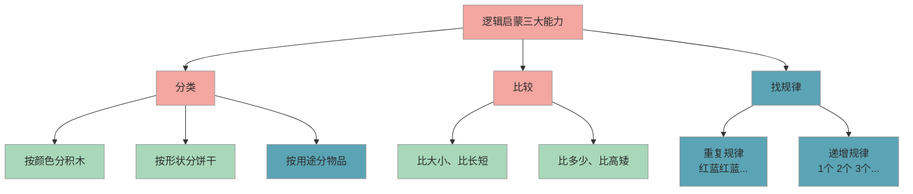

# 图形认知与逻辑启蒙

> 认识基础图形、学会分类比较和找规律，是一年级数学的底层能力。入学前有生活化的感知体验就足够了，不需要提前"学会"。

## 1. 知识点概述

一年级数学有一个"认识图形"单元，要求孩子能辨认**长方形、正方形、三角形、圆**这四种基础平面图形。同时，**分类、比较、找规律**这三项逻辑能力贯穿整个小学数学，是比计算更底层的思维基础。

好消息是，这些能力不需要坐下来"上课"才能学。你日常带孩子逛超市、搭积木、玩拼图的过程中，稍微有意识地引导一下，孩子自然就能建立起基础感知。这篇内容会告诉你具体怎么做。

## 2. 核心内容

### 2.1 四种基础图形

入学前，孩子能在生活中指认出这四种图形就够了，不需要背定义：

| 图形 | 生活中在哪里 | 感知要点 |
|------|-------------|---------|
| **长方形** | 门、窗户、书本、手机屏幕 | 有 4 条边，对面的边一样长 |
| **正方形** | 地砖、魔方的一面、窗格 | 有 4 条边，每条边都一样长 |
| **三角形** | 屋顶、三角尺、切成三角的三明治 | 有 3 条边、3 个角 |
| **圆** | 车轮、硬币、钟表盘面 | 圆圆的，没有角 |

### 2.2 逻辑启蒙三大能力

下图展示了入学前需要感知的三大逻辑能力及其日常表现：

#### 2.2.1 分类

分类是最基础的逻辑能力。孩子能按照**一个标准**把东西分成两组或多组就达标了。

生活中的练习场景：
- 收拾玩具时，让孩子把积木和毛绒玩具分开放
- 洗完衣服，让孩子按家庭成员分袜子
- 超市里，观察水果区和蔬菜区是怎么分的

#### 2.2.2 比较

比较是在两个或多个对象之间找出"谁更……"。入学前能比较**大小、长短、多少、高矮**就够了。

生活中的练习场景：
- 吃水果时问"哪个苹果更大"
- 散步时比一比"爸爸和你谁更高"
- 分糖果时数一数"谁的更多"

#### 2.2.3 找规律

找规律是逻辑思维的进阶能力。入学前能发现**简单的重复规律**就很好了，不需要追求复杂。

生活中的练习场景：
- 串珠子时按"红白红白"交替排列
- 摆碗筷时按"大碗小碗大碗小碗"排列
- 走路时玩"走走跳、走走跳"的节奏游戏

### 2.3 图形与逻辑的结合

图形认知和逻辑能力不是割裂的。你可以用图形来练逻辑：
- **图形分类**：把积木按形状分成几堆（圆的一堆、方的一堆）
- **图形比较**：两个三角形，比比谁更大
- **图形规律**：用积木摆"圆、方、圆、方……"的排列

## 3. 学习方法

这个阶段最好的学习方式就是**在玩中感知**。不需要坐下来做题，也不需要背诵图形定义。下面是一些具体可操作的方法。

### 3.1 易错点

- ❌ 家长拿出图片教孩子背"这是长方形、有四条边"等定义 → ✅ 让孩子用手摸实物（积木、饼干盒），自己感受"有几条边""边一样长吗"，从触觉建立认知
- ❌ 孩子把正方形说成长方形时，家长立刻纠正"说错了" → ✅ 引导孩子自己发现区别："你量量看，这四条边是不是一样长？"正方形其实是特殊的长方形，孩子的说法并没有错
- ❌ 觉得孩子"找不到规律"就是逻辑差，反复训练 → ✅ 找规律需要一定的认知发展水平，5-6 岁能发现简单的重复规律就很好了，不要强求

### 3.2 实操建议

1. **图形寻宝游戏**（每周 1-2 次，每次 10 分钟）：散步或在家时，和孩子比赛谁先找到一个"圆形的东西"或"三角形的东西"，找到就得一分。这比看图片记忆有效得多
2. **积木自由搭建**（日常玩耍中融入）：搭完后随口问"你用了几块三角形的？方形的有几块？"，不要变成考试，就是聊天式的引导
3. **分类收纳日**（每周 1 次）：让孩子参与整理玩具或衣物，先商量"按什么标准分"，再一起动手。这是最自然的分类训练
4. **亲子拼图时间**（每周 2-3 次，每次 15-20 分钟）：拼图天然包含图形辨认、空间感知和逻辑推理。选择 20-40 片的拼图，难度适中
5. **规律接龙游戏**（碎片时间随时玩）：你摆出"红黄红黄"的积木序列，问孩子"下一个应该是什么颜色？"答对了就让孩子出题考你

### 3.3 常见问题

**Q：孩子分不清长方形和正方形，需要担心吗？**

不需要。正方形本身就是长方形的一种特殊情况（四条边都相等的长方形）。入学前能区分"有角的"和"没角的"（比如三角形和圆），就已经建立了基本的图形分辨能力。上了一年级，老师会系统地教，到时候自然就能分清。

**Q：孩子对找规律完全没感觉，怎么办？**

先确认孩子的年龄——4 岁以下对抽象规律的感知能力还在发展中，这很正常。建议从最简单的开始：比如拍手游戏"拍拍-停-拍拍-停"，让孩子用身体感受节奏，再过渡到视觉上的颜色规律。如果 6 岁左右还是完全无感，可以关注但不必焦虑，每个孩子的发展节奏不同。

**Q：要不要买专门的图形认知教具？**

不是必须的。家里的积木、拼图、乐高就是最好的图形教具。如果想买，建议选一套七巧板（十几块钱），它同时覆盖图形认知、空间想象和逻辑组合，性价比很高。不建议买大量"图形闪卡"，看图片的效果远不如动手操作。

## 4. 相关推荐

| 推荐内容 | 说明 | 链接 |
|----------|------|------|
| 数感建立与数量对应 | 数学启蒙从数感开始 | [查看](数感建立与数量对应.md) |
| 凑十法与破十法 | 数学启蒙的核心方法 | [查看](凑十法与破十法.md) |

[← 返回 K0 目录](../../README.md)

---

*最后更新：2026-03-06*

---

> 本资料基于公开知识点整理，仅供个人学习参考。如有侵权请联系删除。
