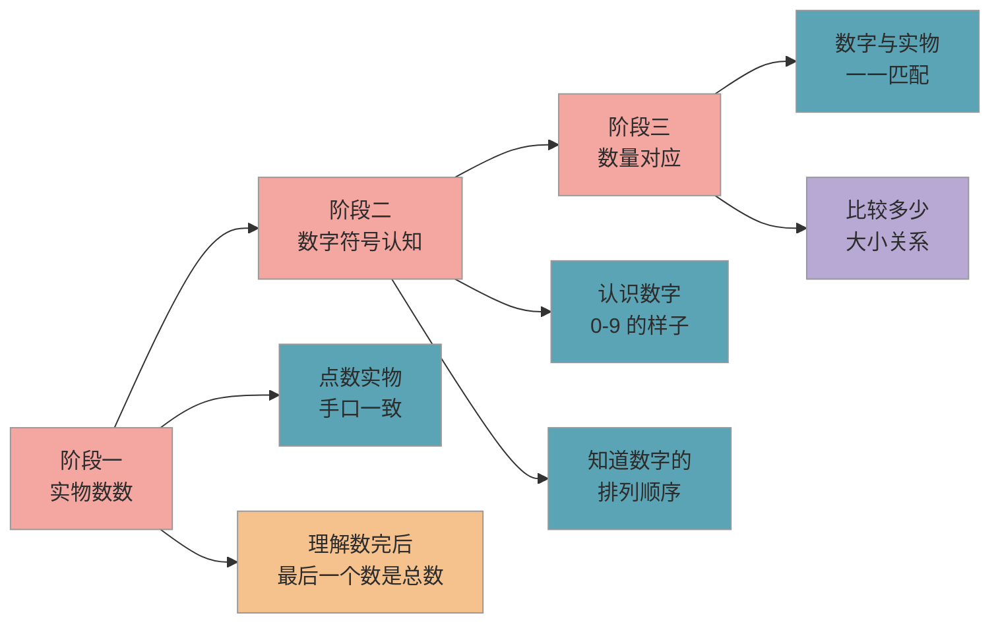

# 数感建立与数量对应

> 数感不是"会背 1 到 100"，而是孩子真正理解数字的含义——知道"3"代表三样东西，"5 比 3 多"。这是所有数学能力的起点。

## 1. 知识点概述

**数感**是孩子对数量的直觉感知能力。它包括三个层面：认识数字符号（知道"5"长什么样）、理解数量含义（5 根手指就是 5）、感知数量关系（5 比 3 多，比 8 少）。

课标要求"引导幼儿尝试用数学的方法解决日常生活中的问题"，而数感正是这一切的基础。你不需要在入学前让孩子背到 100，**建立 1-20 的数感就完全够用了**。很多孩子能流利地"背数"，但让他拿出 7 块积木却要数好几遍——这说明"背数"和"数感"是两回事。

如果你发现孩子能从 1 数到 50，却不理解"给妈妈拿 3 个苹果"是什么意思，别着急，这恰恰说明需要回到实物操作阶段，把数感的地基打牢。

## 2. 核心内容

### 2.1 数感发展的三个阶段

孩子的数感不是一步到位的，它经历从具体到抽象的三个阶段。下图展示了这个发展路径：

### 2.2 阶段一：实物数数（3-4 岁开始）

这个阶段的核心是**手口一致地点数**。孩子需要做到：

1. 用手指一个一个地指着数，嘴里同步说出数字
2. 数到最后一个时，知道这个数就是总数（这叫做**基数原则**，是数感的关键一步）
3. 不管物品怎么摆放——排成一排、围成圈、随便放——数出来的结果一样

你可以这样在家练习：
- 数楼梯台阶——上楼时一阶一阶地数，每天都数
- 吃饭前数碗筷——"今天吃饭的有几个人？帮妈妈数数要摆几双筷子"
- 数水果——"袋子里有几个橘子？你数给我看"

### 2.3 阶段二：数字符号认知（4-5 岁开始）

孩子开始把"数字的样子"和"数字的含义"联系起来。这个阶段要做到：

1. 认识 0-9 十个数字的写法
2. 知道数字的顺序——3 后面是 4，7 前面是 6
3. 能找出生活中的数字——门牌号、电梯按钮、遥控器

**不建议在这个阶段强求孩子"写"数字。** 认识就够了，书写可以等到大班或入学后再练。手部精细动作没发展好时强写数字，反而容易形成错误的握笔习惯。

### 2.4 阶段三：数量对应（5-6 岁重点发展）

这是数感建立的核心阶段，孩子需要把**数字符号**和**实际数量**牢牢挂钩：

1. 看到数字"5"，能摆出 5 个积木
2. 看到 4 颗糖，能说出"这是 4"
3. 能比较两组东西谁多谁少——"这边 6 个，那边 4 个，这边多 2 个"

### 2.5 1-10 和 11-20 分步走

建议把数感建立分成两个小阶段，不要一次到 20：

#### 2.5.1 先打牢 1-10

1-10 是基础中的基础。建议花 2-3 个月的时间让孩子反复操作：

- **分合练习**：5 可以分成 1 和 4、2 和 3——用糖果或积木实际分
- **排序练习**：把 1-10 的数字卡片打乱，让孩子重新排好
- **对应练习**：数字卡片和实物配对——"3"旁边放 3 颗豆子

#### 2.5.2 再拓展 11-20

当孩子对 1-10 非常熟练后，再引入 11-20。关键在于理解**"十几"就是"一个十加几个一"**：

- 用 10 根小棒捆成一捆，再加几根散的——"一捆加 3 根就是 13"
- 这个理解比单纯会数 11-20 重要得多，因为它是后面学"十位""个位"的基础

## 3. 生活中的数感训练

你不需要买专门的教具，生活中到处都是数感训练的素材：

| 场景 | 怎么做 | 训练的是什么 |
|------|--------|-------------|
| 上下楼梯 | 每走一阶数一个数 | 手口一致点数 |
| 分水果 | "家里 4 个人，8 个草莓，每人分几个？" | 数量对应 + 平分概念 |
| 摆餐具 | "今天 5 个人吃饭，帮我拿 5 双筷子" | 数字与实物对应 |
| 坐电梯 | "我们住 12 楼，现在在 8 楼，还要上几层？" | 数量关系 |
| 超市购物 | "帮妈妈拿 3 个苹果、2 根黄瓜" | 听数取物 |

### 3.1 易错点

- ❌ 孩子能流利背数到 50，家长以为数感已经很好了 → ✅ 背数 ≠ 数感。让孩子"拿出 7 块积木"，如果做不到或反复数错，说明需要回到实物点数阶段
- ❌ 急着教"加减法"，跳过数量对应阶段 → ✅ 数量对应是加减法的前提。先确保孩子看到"6"能立刻对应 6 个实物，再进入运算
- ❌ 用"写数字"代替"理解数字"，让孩子反复抄写 1-10 → ✅ 理解远比书写重要。多做实物操作（摆、分、比），少做纸上练习

### 3.2 实操建议

1. **每天 10 分钟生活数感游戏**：上楼数台阶、分水果、摆餐具——不用刻意"上课"，嵌入日常生活即可
2. **准备一盒实物教具**：20 颗围棋子（或纽扣、豆子）+ 10 根小棒 + 数字卡片 1-20。总成本不到 10 元，但够用到入学
3. **多问"多少"而非"对不对"**：与其问"这是 5 吗？"，不如问"这里有几个？"——让孩子主动数，而非被动确认
4. **出错时不纠正答案，而是回到操作**：如果孩子说"这里有 6 个"但其实是 7 个，别说"错了是 7 个"，而是说"我们一起再数一遍"
5. **1-10 彻底熟练后再教 11-20**：判断标准是孩子能毫不犹豫地完成"听数取物"（你说 8，他能快速拿出 8 个）

### 3.3 常见问题

**Q：孩子快 6 岁了还只会数到 10，会不会太晚？**

不晚。数感的质量比范围更重要。如果孩子对 1-10 的理解是扎实的（能配对、能比大小、能分合），那么拓展到 20 只需要 2-3 周。相反，如果只是"会背不会用"地数到 50，入学后反而容易在计算上卡住。

**Q：需要买数学启蒙教具吗？**

不需要专门买昂贵的教具。家里的积木、纽扣、豆子、小棒都是最好的教具。关键不是工具有多精美，而是孩子有没有"动手操作"的机会。如果想买，一套 1-20 的数字卡片 + 一盒围棋子就足够了。

**Q：孩子总是把 6 和 9 搞混，怎么办？**

这在学前阶段非常正常，属于视觉辨识的发展过程，不是"学不会"。你可以用一个小技巧：告诉孩子"6 像哨子嘴朝上，9 像气球线朝下"，配合用手指在空中画几次，很快就能分清了。不用焦虑，大部分孩子入学后自然就不再混淆。

## 4. 相关推荐

| 推荐内容 | 说明 | 链接 |
|----------|------|------|
| 凑十法与破十法 | 数感建立后学计算方法 | [查看](凑十法与破十法.md) |
| 图形认知与逻辑启蒙 | 数学启蒙的另一个维度 | [查看](图形认知与逻辑启蒙.md) |

[← 返回 K0 目录](../../README.md)

---

*最后更新：2026-03-06*

---

> 本资料基于公开知识点整理，仅供个人学习参考。如有侵权请联系删除。
