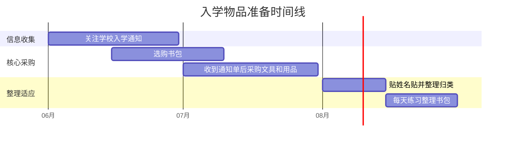

# 入学物品准备清单

> 一份按类别整理的入学物品清单，标注了必要性等级（必备 / 推荐 / 可选），帮你避免多买和漏买。核心原则：**等学校通知单再大量采购**。

## 1. 准备清单

> 以下清单以公立小学的常规要求为基准。大多数学校会在入学前发通知单列明所需物品，**建议先等通知单，再按本清单查漏补缺**。

### 1.1 文具类

| 物品 | 必要性 | 建议数量 | 选购要点 |
|------|--------|----------|----------|
| 铅笔（HB） | 🔴 必备 | 10-20 支 | 三角杆比圆杆好握，低年级不要用自动铅笔 |
| 橡皮 | 🔴 必备 | 3-5 块 | 白色绘图橡皮擦得最干净，不选花哨造型款 |
| 直尺 | 🔴 必备 | 1 把 | 15cm 透明款，带清晰刻度即可 |
| 转笔刀 | 🔴 必备 | 1 个 | 手摇式比电动式更适合低年级，削出的笔尖更均匀 |
| 铅笔盒/笔袋 | 🔴 必备 | 1 个 | 简洁款，避免多功能弹射式（上课容易分心） |
| 文件袋 | 🟡 推荐 | 3-5 个 | 按科目分色收纳练习纸和作业，A4 尺寸 |
| 包书皮 | 🟡 推荐 | 10 张左右 | 透明自粘款最方便，部分学校会统一要求 |
| 姓名贴 | 🟡 推荐 | 1 套 | 防水款，贴在所有文具和课本上防丢失 |
| 彩色铅笔/蜡笔 | 🟡 推荐 | 12 色 1 套 | 美术课会用到，12 色足够，不必买 24/36 色 |
| 荧光笔 | 🟢 可选 | — | 低年级基本用不到，二年级后再考虑 |

### 1.2 生活用品类

| 物品 | 必要性 | 建议数量 | 选购要点 |
|------|--------|----------|----------|
| 水杯 | 🔴 必备 | 1 个 | 防漏、轻便，容量 350-500ml，带吸管或直饮口 |
| 餐具（勺子/筷子） | 🔴 必备 | 1 套 | 需在校午餐的学校必备，装在专用收纳盒里 |
| 手帕/纸巾 | 🔴 必备 | 若干 | 每天放一包小包纸巾在书包里 |
| 垫板 | 🟡 推荐 | 1 块 | A4 大小，垫在作业本下写字更工整 |
| 跳绳 | 🟡 推荐 | 1 根 | 很多学校体育课有跳绳要求，可计数款方便练习 |
| 雨衣/雨伞 | 🟡 推荐 | 1 件 | 轻便折叠伞或儿童雨衣，书包里备用 |
| 室内鞋 | 🟡 推荐 | 1 双 | 部分学校要求换鞋入教室，提前确认 |
| 坐垫 | 🟢 可选 | 1 个 | 冬天椅子冷时有用，需看学校是否允许 |

### 1.3 书包选购

| 物品 | 必要性 | 建议数量 | 选购要点 |
|------|--------|----------|----------|
| 书包 | 🔴 必备 | 1 个 | 详见下方"2.1 书包怎么选" |
| 补习袋/手提袋 | 🟡 推荐 | 1 个 | 装美术材料等副科用品，减轻主书包负担 |

### 1.4 学习辅助用品

| 物品 | 必要性 | 建议数量 | 选购要点 |
|------|--------|----------|----------|
| 田字格练习本 | 🔴 必备 | 3-5 本 | 语文写字用，低年级选大格 |
| 拼音练习本 | 🔴 必备 | 2-3 本 | 四线三格，练习拼音书写 |
| 数学练习本 | 🔴 必备 | 2-3 本 | 方格本，格子大小适中 |
| 口算本 | 🟡 推荐 | 1 本 | 每天 5-10 分钟练口算，培养计算习惯 |
| 识字卡片 | 🟢 可选 | — | 孩子认字量不多时可辅助，不必提前囤 |
| 点读笔/学习机 | 🟢 可选 | — | 不建议提前买，开学后观察 1-2 个月再决定 |

## 2. 选购建议

### 2.1 书包怎么选

关键看三点：**自重轻**（空包不超过 800g）、**有护脊设计**（背部有支撑垫、肩带宽且可调节）、**容量合适**（能放 A4 课本和水杯，不要过大）。

选书包时带孩子一起去，让 ta 试背。肩带应贴合肩部，背包底部与腰齐平。装满书后总重量建议不超过孩子体重的 10%-15%。

### 2.2 文具选购原则

**越朴素越好**是一年级文具的核心原则。花哨的多功能文具（变形笔盒、带玩具的铅笔）是上课走神的主要来源之一。

铅笔建议选三角杆 HB，比圆杆更容易握稳，比 2B 不容易断芯。首批买 10 支左右即可，低年级铅笔消耗快，后面再补。

橡皮选白色长方形绘图橡皮，擦得干净、不留痕。造型橡皮（食物形状、带香味的）容易让孩子上课分心。

### 2.3 不建议提前买的东西

有些物品看起来有用，但不需要提前准备：

- **自动铅笔**：笔芯太细，低年级写字力度大容易断，学校通常不允许使用
- **钢笔**：一般三年级才开始用
- **大量练习册**：先看学校进度和老师要求，避免买了不对路
- **电子产品**：学习机、平板等开学后根据实际情况决定，提前囤容易买到不合适的

## 3. 时间节点

| 时间 | 该完成的准备 | 备注 |
|------|-------------|------|
| 入学前 3 个月（约 6 月） | 关注目标学校的入学通知 | 了解学校有无特殊物品要求 |
| 入学前 2 个月（约 7 月初） | 选购书包 | 让孩子试背，提前适应 |
| 入学前 1-2 个月（7 月） | 收到学校通知单后采购文具和生活用品 | **通知单是最权威的清单** |
| 入学前 2 周（8 月中旬） | 所有物品准备齐全，贴好姓名贴 | 让孩子认识自己的每件物品 |
| 入学前 2 周起 | 每天练习整理书包 | 让孩子自己动手装和取 |
| 入学前 1 天 | 按课表装好第一天的书包 | 和孩子一起完成，减少紧张感 |

以下时间线帮你直观把握准备节奏（以 9 月入学为例）：

## 4. 过来人经验

### 4.1 易错点

- ❌ 买一堆花哨文具，孩子上课玩文具分心 → ✅ 文具越朴素越好，功能够用即可
- ❌ 完全按网上"最全清单"大量采购，买了一堆用不上的 → ✅ **先等学校发的通知单**，按要求买，本清单用于查漏补缺
- ❌ 一次性囤太多文具，结果孩子不喜欢或学校要求不同 → ✅ 基础文具先买 1-2 周用量，开学后根据实际需要再补
- ❌ 所有东西家长代劳，孩子不认识自己的物品 → ✅ 带孩子一起采购和整理，让 ta 对自己的物品有归属感

### 4.2 实操建议

1. **等通知单再大量采购**：学校通常在入学前 1-2 个月发通知单，上面会列明文具品类、练习本规格甚至包书皮颜色要求，这是最准确的采购依据
2. **带孩子一起选书包**：让 ta 试背，确保肩带舒适、大小合适；孩子参与选择后会更爱惜
3. **所有物品贴上姓名贴**：低年级孩子经常混拿同学的文具，姓名贴是防丢的最简单方法
4. **入学前 2 周开始练习整理书包**：每天让孩子自己练习"装书包 → 背出门 → 打开取东西 → 放回去"的完整流程
5. **列一张"消耗品补货清单"**：铅笔、橡皮、纸巾等是消耗品，记下常用规格，方便后续快速补货

### 4.3 常见问题

**Q：需要买学习机或点读笔吗？**

一年级暂时不需要。先观察孩子开学后 1-2 个月的学习情况，如果确实有需要再考虑。提前囤容易买到不适合的型号，而且孩子可能并不需要。

**Q：文具需要买好的吗？**

不需要追求高端。文具核心是功能——铅笔能写、橡皮能擦干净就行。低年级文具消耗极快（铅笔一周可能用掉好几支），买性价比高的更划算。

**Q：学校会统一发物品吗？**

不同学校差异较大。有些学校会统一配发部分文具或练习本，有些学校什么都不发。所以一定要等学校通知单出来再大量采购，避免重复购买。

## 5. 推荐好物

> 以下链接为推荐链接，通过链接购买可为本项目提供微小支持。所有推荐均为京东自营商品，不推荐无需强买。

### 5.1 文具类

- [得力洞洞铅笔 HB 三角杆](https://union-click.jd.com/jdc?e=618%7Cpc%7C&p=JF8BATIJK1olXwcBUlhdAE0SBV8PHF0dXQUDZBoCUBVIMzZNXhpXVhgcDBsJVFRMVnBaRQcLWgEEXF5eCVRORjNVKyFoWWZAXSQDbTxfQTlbRQEcGAVqHRhRBHsWM2wJGV0dWAcBVldtOEsQMy1mz9Szib2og_nr3P-R2tmTwvqBiqCkjefc3MCxM244G10TXwQLV1leDUwfAV8PG1IlClJfDBcKTnsnM2w4HFscSQBwFQxJDjknM284GGsVXAYDUVlVAUsWAXMIGF8cWwIeVFhbCkkeAGgIE1kWVDYAVV9ZAXsn3eK4Y1hcPWJ1VDgPVQBzVDEBZIWY7RdpLVZdCEgGMz1DWylRL317LgcaXC9CdihOfD5DBwZAXTBfCkxzBWtscz5vXwRQHw0eCRcnBl8KHV4SXjY) — 三角杆矫正握姿，HB 硬度适中
- [晨光 4B 白色绘图橡皮](https://union-click.jd.com/jdc?e=618%7Cpc%7C&p=JF8BAUoJK1olXwMHUFdcDUsTAl8IGloUVAUCXVlcAEknRzBQRQQlBENHFRxWFlVPRjtUBABAQlRcCEBdCUoWCmwIElwUVQQdDRsBVUVTXDdWRCdBCF5SMQ4LBEh5AgEIKw5gHWAcKCAOaE5XXRoIXQccA2FHKC5RBHsWM2wJGV0dWAcBVldtOEsQMzlmG1oUXAMHVVlUDSVEWCdJUw1PBk5LZF9tCE0RAW0BGFwRXwMEXG5aCEInVDtVQxJCGzYyZF1tD0seF2l6WgkBW3QyZF5tC3sXAm8JH1IVXgEBU0JdCk8fCm4UG10TXwQLV1lZCU4TBF8KGloRVDYyitPtdk5vYi58fTBoNFp6ARcJX5Was350bFIXXwITZCk2fh5FCgZeQjhTKVJFMDYJaTVyaCRtZzUXOnVrICVdejxOBxJMaBB9JWIyUW5fDk4QAF8) — 擦除干净不留痕，无碎屑
- [得力 15cm/20cm 透明直尺](https://union-click.jd.com/jdc?e=618%7Cpc%7C&p=JF8BATAJK1olXwcBUlhdAE0SBV8KEl8cXgQyEAEFVhQnWipNWhkeQxhaEQoBFxBCHD1WR0UXVAILV1xCUQ5LXl9zBS8RDQZdUj1DVAt8ahAAEgtqWFViWFJtCXsUAm0OE14UXgQLZG5dD3tVbbuHvY-u99Gl4orpjpKhmLapj4yz-9-71YrWrnsWM28OHVkXVAUFXVlbAEonBG8BKwxBAF5LAxhtOHsUM2gIEk8TL0dQQFgvOHsXM2w4G1oVXAQHUVleCEMLA20NHlMQQQYEUlxfAUgQBWcKE1glXwcDUFdtOJWaswwAHwwcLVhwAAQvUD5EBxjWlusEL3YCUF9bGXtgaBldSVJ8C19hEiolSRJccA52XT5oAENsVjkuYT9sAx1_Ql8RKm1FNgU5OE4nAWkNHFgl) — 透明材质，刻度清晰
- [得力金属手摇削笔器](https://union-click.jd.com/jdc?e=618%7Cpc%7C&p=JF8BAVAJK1olXw4EVlpfCEoeCl8IGloUXA8FVldZC0onRzBQRQQlBENHFRxWFlVPRjtUBABAQlRcCEBdCUoWAmYPGVIRXgcdDRsBVUVTXDdWRCdBCF5SMQ4LBEh5AgEIKzt2CHFjISIZahhXYg8BBSJ-I0JBAwhRBHsWM2wJGV0dWAcBVldtOEsQMy1mz9Szib2og_nr3P-R2tmTwvqBiqCkjefc3MCxM244G10TXwQLV1hdCkgWAV8PG1IlClJfDBcKTnsnM2w4HFscSQBwFQxJDjknM284GGsVXAYDXV5bCUsXBXMIHl0TVQIeVFhbCkkeAGkJHV8TXjYAVV9ZAXsn3eK4bV1tJGEBDyghXwlRag5RZoWY7RdwJF5fCksGM2sOawtdXUR3JgYdQRwVXRhQZQRVNkVZVjBfUxEfeBFtXjNnKl9LHVwPVysnBl8KHV4SXjY) — 金属材质耐用，可调粗细
- [得力 EVA 大容量笔袋](https://union-click.jd.com/jdc?e=618%7Cpc%7C&p=JF8BATwJK1olXwcBUlhdAE0SBV8IGloUWQYKVllZCUonRzBQRQQlBENHFRxWFlVPRjtUBABAQlRcCEBdCUoWB28AGVwRXAcdDRsBVXsSXS5hHhx3LmZYCCUDQ1EeQQlceBN1UQoyVW5eCUkRC2oJGFkcbTYCU24fZp-YpbuzsYyy69K20ofrk5K2l7iuvYKs3NKJ8m5cOEsRBW0KElgTWAUKUF5tD0seMzhcRgNcCkAyZG5eOEwXCnsOaRpHSQBwZG5dOEgnA24IGl4SVQ8CUV9BCE4XCm8OB1sTWwQAXV1bCkMRAGk4GVoUWQ8yZIDQuDQTeBEJbyRWG3JfJgYKdjXJjt8ZaSsVWQcERW49ACBzehN3az5FP1tBVltaQAh-CxRQUjl7X2R3UhwBAQxSZjlSciETKX8FZFttCk0SBGw4) — EVA 材质抗压防水
- [得力科目分类文件袋](https://union-click.jd.com/jdc?e=618%7Cpc%7C&p=JF8BAT8JK1olXwQBVV9fC04RAl8IGloUXwQKU19ZDkonRzBQRQQlBENHFRxWFlVPRjtUBABAQlRcCEBdCUoWAW0AHFoRWwcdDRsBVUVTXDdWRCdBCF5SMQ4LBEh5AwEIKwRvCHpwJDwfaENfURZQTjhIVWV9IC5RBHsWM2wJGV0dWAcBVldtOEsQMzlmG1oUXAcDVF5fC3sWM28OHVkXVAUEUlZUCkMnBG8BKwxBAF5LAxhtOHsUM2gIEk8TL0dQQFgvOHsXM2w4G1oVXAIHUVpcAU4LA28AH1wTQQYEUlxfAUgRBWgOGFMlXwcDUFdtOJWasw0AYRhjWVt2MVY-QDR8BirWlusEL3YCVlZfGXtKSm1pYVNQInFrNDcYTSoVBzFTWgZcJXRsVgJUdUIXBzQKbDIRIwULCzg5OE4nAWkNHFgl) — A4 网格拉链袋，按科目分色
- [晨光自粘透明包书皮](https://union-click.jd.com/jdc?e=618%7Cpc%7C&p=JF8BAUoJK1olXwQFUV1dDksSBl8IGloUWgUEXVpaAUsnRzBQRQQlBENHFRxWFlVPRjtUBABAQlRcCEBdCUoWBGwOEl8SVAYdDRsBVUVTXDdWRCdBCF5SMQ4LBEh5AgEIK0VhWVleVyoLaCtpexl_Ww9QH2ZdNAhRBHsWM2wJGV0dWAcBVldtOEsQMzlmG1oUXAMHVVlUDSVEWCdJUw1PBk5LZF9tCE0RAW0BGFIUWAILXG5aCEInVDtVQxJCGzYyZF1tD0seF2l6WgkBW3QyZF5tC3sXAm8JH1kXVQAGV0JdDUoeAWgUG10TXwQLV1dcC0gRB18KGloRVDYyitPtdTgfaG9_ZzJJFG1cNAJeaJWas35jYlsdVQATZAJaSStEBThOXidNW3RrDj0AcCpRcDJMUzUXAE1wVxdfQQxSehtsEwJsHkUyUW5fDk4QAF8) — 透明自粘免裁剪
- [防水姓名贴](https://union-click.jd.com/jdc?e=618%7Cpc%7C&p=JF8BASsJK1olXgYLU1tfDEkSC18IGloVXQUKVFhYC0knRzBQRQQlBENHFRxWFlVPRjtUBABAQlRcCEBdCUoXA2wAG10QXgQdDRsBVXtkUw5JfCRgDWNWLjkYdQ1AZSZQRV9DUQoyVW5eCUkRC2oJGFkcbTYCU24LZksWAm4JE1MRXAUyVW5dDk0VAWYLElkVXgYKZFldAXtAVzJQUgxTbTYyV25aCEIDBR1JSU8TLzYyVG5eOEsWA2cLG1gVWgUKSF5ZAEgTAHMIHV0XXw8BXV1YCE8TM20JGl8cbTbc2e42CzJkVBsPW1leIwViCwUU1sanEgRxG1MdWxcyFxY_QDZIfz0NQCF1KWVkAC0Be05FASdsdVlLHHNBEV46TU5_eTh2XiFTLzYHZFxbDUwUMw) — 防水耐磨不易脱落
- [得力油性彩色铅笔 12 色](https://union-click.jd.com/jdc?e=618%7Cpc%7C&p=JF8BATwJK1olXwQAVVZbDkwSAl8IGloUXQMGXF1ZD0onRzBQRQQlBENHFRxWFlVPRjtUBABAQlRcCEBdCUoWA2oME1gRWgcdDRsBVXtPWD9yW1lNJmUBKgMOQRcUXjBsXAJTUQoyVW5eCUkRC2oJGFkcbTYCU24fZp-YpbuzsYyy69K20ofrk5K2l7iuvYKs3NKJ8m5cOEsRBW0KElgcWgQHVF5tD0seMzhcRgNcCkAyZG5eOEwXCnsOaRpHSQBwZG5dOEgnA24IE1gVXQcGXVpBCEseAW4AB1sTWwQAXV1UDEIeAWc4GVoUWQ8yZIDQuCkUeQd6bAkUAVpgEiwLdgnJjt8ZZywXXw4DRW4GTyBgVD0BYy1zDw5hJh85WDlBRGhzSz97XwIBUB4lbSxVdQhMTSVpKkR8ZFttCk0SBGw4) — 12 色，油性上色均匀

### 5.2 生活用品类

- [乐扣乐扣儿童保温杯](https://union-click.jd.com/jdc?e=618%7Cpc%7C&p=JF8BATQJK1olXDYCVV9dCk4TC20AE10lGVlaCgFtUQ5SQi0DBUVNGFJeSwUIFxlJX3EIGloVXwMGXFxVAE0IWipURlVRAl5cCyIJXRNHZj9eF1h7XGgCZDgaAExjVhl0eCxvLg9gPSQ2TC9qVw8EF2sUbQUDVlhVDUoUAWY4K1sSbVBsVF9cCUkRAWoBGGsUbQYEUlxfAUgeCmYAH18lWgYLZAkJVRNeVCk4K2sWbQECXUpbegpFF2l6K2sVbQUyVF9dCUIXBW4JE1gJXQQLUF5fFEsRBW0KElgcVAIGVFxtCkoWB2Y4K4WY7XJ3LDsEfBwXfD9tRyFrP0Dc2e5MeiAXB2oZK1lKO2IHMyAKYC9qBj1ITAxNVGNdMzcPQyUVUShpeFJMJlpqL1w4UB8RAC04HmsVXwYKZA) — 316 不锈钢，吸管防洒漏，550ml
- [儿童便携餐具套装](https://union-click.jd.com/jdc?e=618%7Cpc%7C&p=JF8BASwJK1olXwMKU1xZDU8SCl8IGloVVAMGXVZbCUwnRzBQRQQlBENHFRxWFlVPRjtUBABAQlRcCEBdCUoXCmoMElMTXAEdDRsBVXtAXhJLElN2PWZCV1suDxIJWCpTYBh1UQoyVW5eCUkRC2oJGFkcbTYCU24fZp-ruLmwg4Kjxt-jwG5cOEsRBW0KElgdXQYLU1ltD0seMzhcRgNcCkAyZG5eOEwXCnsOaRpHSQBwZG5dOEgnA24IGlwWWAUDU1dBCEkRBWsOB1sTWwQAXV1VCUIVBmk4GVoUWQ8yZIDQuD5kcAxwHghULm97FC4UWDXJjt8ZZywRWg8CRW4JTS1tSjp9WiZPXHZdAho8ChwfBBF0czl7X0dSPDcgYzBLfgoJQytiGwB7ZFttD0sfBF8) — 筷子+勺子+收纳盒
- [得力 A4 透明垫板](https://union-click.jd.com/jdc?e=618%7Cpc%7C&p=JF8BAT4JK1olVAEFUV5cDE8RM28JGlkWXwYHVV9aAXtTXDdWRGtMGENDFlVDFhNSVzMXQA4KD1heSl5cCUkUAW8NGloSVBlbEQIABg9IWzFXZw9ABVZnBAhRCyUXbW84YgJVAVhkFAc9SzUXUwwJZCdXGg9VAlJROEonAG4KHVMQXAUAXW5tCEwnVQEIGloUXAcCVFxeOEonA2kOGVkcXg4AVlpfDXsQA2Y4TA9IBU9VEm5tOEgnBG8BD11nHFQWUixtOEsnAF8IGlsUWAEKXV5ZDlcXA2cJH1kJXQAEVlxUC0MVAmgOGWsXXAcGXW5t1sanZBhyGT8cD25fJAIhSSpJZrGFq0ppKg8GUFpMOE0TA29vHV1uHn9ABl8DUj1DYDtqHl52B2gAEw04aRZpXQxLcF5XG2F3FVZtDXsVBWoPGGs) — 透明材质，0.6mm 厚度适中
- [计数跳绳](https://union-click.jd.com/jdc?e=618%7Cpc%7C&p=JF8BASEJK1olXDYCVV9cCkIXAGsAElIlGVlaCgFtUQ5SQi0DBUVNGFJeSwUIFxlJX3EIGloUXw8CV1pVAUIIWipURmt2B1lRMD04aCttQwh3YxoQXQJVADUbBEcnAl8LGlkTVQMDV1xUOHsXBF9edVsUXAcHVF9VCk0nAl8IHV0XXw8BXFpZAEgWM2gIEmtCCVtaHQkbOHsnAF8PG1IBW3RDBkpbensnA18LK1sUXQcHU1ZbAEsfH28JGlsXWRoCUlhfCkIUC2sKH14VbQQDVVpUOHvJjt94Gh1qOwFiMAItQ0N-WQZSxdalTHp1XVpZDFonVj90RxBNJGZrKys5bBNiXDYLfzB3Hg9VOlwFVjdScBR_bzJhKF8KDiwlWnsSM28KG1Il) — 可计数，可调长度

### 5.3 书包

- [护脊书包](https://union-click.jd.com/jdc?e=618%7Cpc%7C&p=JF8BAT4JK1olVA4LXV9dAEMeM28JGloRXwYAUl5aDntTXDdWRGtMGENDFlVDFhNSVzMXQA4KD1heSl5cCUoTAW8KHVsSWxlbEQIABg9IWzFXZw9ABVZnBAhRCyUWbW84bhJlBANWVw09QzFqXgdRGQIdBlRSAlJROEonAG4KHVMQXAUAXW5tCEwnVQEIGloUXAcCVFtfOEonA2kOGVkcXg4EXVhfDHsQA2Y4TA9IBU9VEm5tOEgnBG8BD11nHFQWUixtOEsnAF8IGlsUVAcEVFlVDVcXA2sAHVsJXQAEVlxUC0MRB24IGmsXXAcGXW5t1sanehx-aT1lAE9aDilZYAMVZbGFq0pnLQYGVVhMOBNRZzJyTwVWJmR6AgsuDU5cWyp1RShsX2gAAQlYbQ9LBzlzeglLDXB5PyFtDXsXBW0LE2s) — 护脊减负，宽肩带，轻便大容量

### 5.4 学习辅助

- [田字格练习本（大格）](https://union-click.jd.com/jdc?e=618%7Cpc%7C&p=JF8BATYJK1olXDYCVV9eD0kfCmwNElwlGVlaCgFtUQ5SQi0DBUVNGFJeSwUIFxlJX3EIGloWWgQKXV1YAUwIWipURlVRAl5cCyIJXRNHZj9eF1h7XGgCZCIKCg5RQ2gPeA0SHF5-BwFcSx9FVh8EF2sUbQUDVlhVDUoUAWY4K1sSbVBsVF9cCU4RAG0OHWsUbQYEUlxfAUkWAmsLE1MlWgYLZAkJVRNeVCk4K2sWbQECXUpbegpFF2l6K2sVbQUyVF9dCUwTAG0PHF0JXQMAUVhZFEsRBW0KElkUXAcCVlZtCkoWB2Y4K4WY7W0HPV8iDE5FdTx2RzpTPXjc2e5MYzIXC2cOCmtxI2BAAg0FQyxgBRlKWhB8KnFKNAA0aBd5AW4ARjtMIgJxMx47QBAWVBhVK14lXwAHU11t) — 大格规范字形
- [拼音练习本（四线三格）](https://union-click.jd.com/jdc?e=618%7Cpc%7C&p=JF8BAUoJK1olXwECVlxcCkkUCl8IGloWXQMDV1xaC0gnRzBQRQQlBENHFRxWFlVPRjtUBABAQlRcCEBdCUoUA2oJGFkSXgUdDRsBVUVTXDdWRCdBCF5SMQ4LBEh5AgEIK1wXOQ5hFFgAaBtPdR9AYilFIQFkJC5RBHsWM2wJGV0dWAcBVldtOEsQMy1mzdGQibK4gMv23PKP1MmuwuKUiY2kZF9tCE0RAW0BGVoWWwAAV25aCEInVDtVQxJCGzYyZF1tD0seF2l6WgkBW3QyZF5tC3sXAm8JH14QWA4AU0JdDUIQCmkUG10TXwQLVl9eDUIXAV8KGloRVDYyitPtfUtWdBd6fwYQOF1QXRkuVJWas350bFkXVQcTZBodDC5eeStVZzpDNWJFCzcmAAtNSyxtcjUXClB0HwYtT0lrfRQISwV9HlEyUW5fDk4QAF8) — 四线三格标准格式
- [数学练习本（方格本）](https://union-click.jd.com/jdc?e=618%7Cpc%7C&p=JF8BAS0JK1olXwMAV1hZDU4WC18IGlsTWAQEU11ZC0keB19MRANLAjZbERscSkAJHTdNTwcKBlMdBgABFksWA2kNGV0SXgIBVldZFxJSXzI4eRxeB2R8CV84AFEQUAhuTjxjBlZxNFJROEonAG4KHVMQXAUAXW5tCEwnQgEIHlwdXQYKXW5cOEsRBW0KElkUWA4DVlxtD0seMzhcRgNcCkAyZG5eOEwXCnsOaRpHSQBwZG5dOEgnA24IGlIUWwYFXFxBCEwWAGwIB1sTWwQAXVxcDUwQC2o4GVoUWQ8yZIDQuCMeYjBpH19oW0VLByMOdxHJjt8ZaSsVXw4ARW5aTyxXXDNwRQJCKVJBAD4_DisVWS9WRlN7H0BWIANUcgx8YCRvTD1uAg9ZZFttCk0SBGw4) — 方格对齐数字和竖式

## 6. 相关推荐

| 推荐内容 | 说明 | 链接 |
|----------|------|------|
| 开学第一周生存指南 | 物品准备好后看第一周攻略 | [查看](开学第一周生存指南.md) |
| 书包整理与文具管理 | 买完之后学整理 | [查看](../habits/书包整理与文具管理.md) |

[← 返回 K0 目录](../../README.md)

---

*最后更新：2026-03-06*

---

> 本资料基于公开知识点整理，仅供个人学习参考。如有侵权请联系删除。
