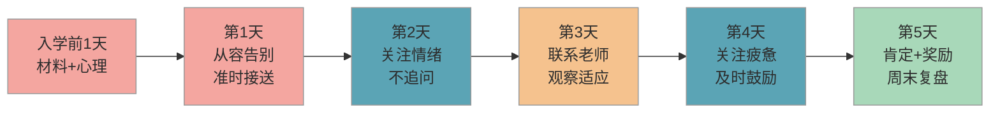

# 开学第一周生存指南

> 第一周不完美是完全正常的——这篇指南帮你和孩子一起度过开学适应期，知道每天该做什么、遇到状况怎么应对。

## 1. 第一周事项清单

课标明确一年级上学期为**入学适应期**，学校会以活动化、游戏化的方式帮助孩子过渡。你要做的，是在家配合好这个过程。

### 1.1 孩子要做的事

| 事项 | 必要性 | 紧急度 | 说明 |
|------|--------|--------|------|
| 记住自己的班级和座位 | 🔴 必备 | 第1天 | 入学前可以带孩子提前熟悉校园 |
| 学会独立上厕所、洗手 | 🔴 必备 | 第1天 | 知道厕所在哪、会自己擦拭和冲水 |
| 认识班主任和几个同学 | 🔴 必备 | 第1-2天 | 鼓励孩子主动说"你好"，但不强迫 |
| 学会听上下课铃声 | 🔴 必备 | 第1-2天 | 知道铃响意味着什么，跟着大家行动即可 |
| 能在座位上坐住15-20分钟 | 🟡 推荐 | 第1-3天 | 一年级初期课堂节奏较慢，不要求全程坐住 |
| 学会排队打饭或吃午餐 | 🟡 推荐 | 第1-3天 | 提前告诉孩子学校午餐流程 |
| 自己整理书包和文具 | 🟡 推荐 | 第3-5天 | 前几天可以和孩子一起整理，逐步放手 |
| 记住放学接送地点 | 🔴 必备 | 第1天 | 和孩子约定固定的等候位置 |
| 尝试和一个同学交朋友 | 🟢 可选 | 第3-5天 | 有些孩子需要更长时间，不着急 |

### 1.2 家长要做的事

| 事项 | 必要性 | 紧急度 | 说明 |
|------|--------|--------|------|
| 确认接送时间和路线 | 🔴 必备 | 第1天前 | 第一天建议预留充足时间，避免迟到 |
| 准备好学校要求的所有材料 | 🔴 必备 | 第1天前 | 照片、表格、回执单等，提前一天检查 |
| 每天放学后问孩子"今天开心吗" | 🔴 必备 | 每天 | 关注情绪，而不是"学了什么""表现好不好" |
| 保持规律的作息时间 | 🔴 必备 | 每天 | 晚上8:30-9:00入睡，早上留够起床和早餐时间 |
| 加入班级家长群 | 🟡 推荐 | 第1-2天 | 关注老师通知，但不要被群消息焦虑裹挟 |
| 了解学校午餐和课后服务安排 | 🟡 推荐 | 第1-2天 | 有疑问直接问老师，不要在家长群里猜测 |
| 记录孩子每天的情绪变化 | 🟡 推荐 | 每天 | 简单记几个词就行，便于发现适应趋势 |
| 与老师建立初步联系 | 🟡 推荐 | 第3-5天 | 详见下方"与老师的第一次沟通"部分 |
| 控制自己的焦虑，不过度追问 | 🔴 必备 | 每天 | 你的情绪会直接影响孩子的适应状态 |

### 1.3 常见突发情况应对

| 情况 | 必要性 | 紧急度 | 应对方式 |
|------|--------|--------|----------|
| 孩子哭闹不想上学 | 🔴 必备 | 随时 | 共情但坚定——"我知道你有点紧张，放学妈妈准时来接你" |
| 孩子找不到教室/厕所 | 🔴 必备 | 第1-2天 | 提前告诉孩子"找不到就问老师或戴红领巾的大哥哥大姐姐" |
| 孩子不敢上厕所 | 🔴 必备 | 第1-3天 | 入学前带孩子看一次学校厕所，消除陌生感 |
| 孩子说"没有人跟我玩" | 🟡 推荐 | 第2-5天 | 正常现象，引导孩子主动找一个同学说话即可 |
| 孩子回来说"老师很凶" | 🟡 推荐 | 随时 | 先了解具体情况，一年级老师管纪律时语气会比幼儿园严肃，这是正常的 |
| 文具丢了/弄坏了 | 🟢 可选 | 随时 | 提前多备一份，告诉孩子"没关系，明天带新的" |

## 2. 应对建议

### 2.1 哭闹不想上学

这是开学第一周最常见的情况，大约有三分之一的孩子会出现不同程度的分离焦虑。

**应对要点**：

- **共情 + 坚定**：蹲下来对孩子说"我知道你舍不得妈妈，这很正常"，然后明确告诉 ta 放学会准时来接
- **告别要干脆**：不要在校门口反复拉扯、偷偷观察，越拖孩子越难平静
- **给一个"安全锚"**：在孩子书包里放一个小物件（比如一张全家福照片），告诉 ta"想妈妈的时候可以看一看"
- **放学后及时肯定**：不管孩子在校表现如何，放学见面第一句话是"你今天自己在学校待了一整天，真了不起"

> ⚠️ 如果孩子持续两周以上每天哭闹、拒绝进食、夜间频繁惊醒，建议咨询学校心理老师或儿童心理专业机构，排除适应障碍等问题。

### 2.2 不敢上厕所

不少孩子因为学校厕所和家里不同（蹲坑 vs 马桶、没有隔间等）而憋着不去。

**应对要点**：

- 入学前带孩子实地看一次学校厕所，让 ta 知道厕所长什么样
- 告诉孩子"课间十分钟就是让你上厕所、喝水的，老师不会不让去"
- 在家练习使用蹲坑（如果学校是蹲坑的话）
- 提醒孩子如果课上实在憋不住，可以举手告诉老师

### 2.3 不会买午餐/不适应学校午餐

**应对要点**：

- 提前了解学校是统一配餐还是食堂打饭
- 如果是食堂打饭，教孩子排队、端盘子、用公勺的基本流程
- 告诉孩子"吃不完没关系，但要尝试吃几口"
- 前几天可以在书包里放一小份备用零食（饼干、面包），以防孩子实在吃不惯

### 2.4 与老师的第一次沟通

**时机**：建议在第一周的周三到周五，不要第一天就找老师——老师第一周也很忙。

**方式**：

- 优先通过班级群私信老师，简短表达即可
- 内容模板："老师您好，我是 XX 的妈妈/爸爸。孩子第一周适应还不错/有些紧张，想了解一下 ta 在学校的表现，有什么需要我们在家配合的？"
- **不要做的事**：不要发长消息、不要提过多要求、不要在群里问"我家孩子表现怎么样"

## 3. 时间节点

以下是开学第一周每天的重点事项，帮你按天推进：

| 时间 | 孩子的重点 | 家长的重点 |
|------|-----------|-----------|
| **入学前1天** | 和家长一起按课表装好书包；早睡 | 检查所有材料是否齐全；确认明天接送安排；调好闹钟 |
| **第1天（周一）** | 认识教室、座位、厕所位置；认识班主任 | 提前到校，从容告别；放学准时接，问"今天开心吗" |
| **第2天（周二）** | 开始适应上下课节奏；尝试课间自己去厕所 | 关注孩子情绪变化；不追问"今天学了什么" |
| **第3天（周三）** | 尝试自己整理课桌；和旁边同学说说话 | 如有需要，可以简短联系老师了解情况 |
| **第4天（周四）** | 开始习惯学校午餐流程；记住每节课在哪个教室 | 观察孩子是否出现明显疲惫或抵触 |
| **第5天（周五）** | 完成第一周，建立初步安全感 | 周末安排一个孩子喜欢的活动作为奖励 |

> 下方是第一周家长行动流程的可视化概览：

## 4. 过来人经验

### 4.1 易错点

- ❌ 放学后反复追问"今天老师讲了什么""你举手了吗""有没有被批评" → ✅ 只问一个开放问题"今天有什么好玩的事吗"，让孩子自己愿意说
- ❌ 第一天就要求孩子"表现好""不许哭""要勇敢" → ✅ 允许孩子紧张和不适应，告诉 ta"第一天紧张是正常的，妈妈小时候也一样"
- ❌ 在家长群里看到别人家孩子"表现很好"就焦虑 → ✅ 每个孩子的适应节奏不同，有的孩子第一天就适应，有的需要两三周，都是正常的

### 4.2 实操建议

1. **入学前一周开始调整作息**：按照上学时间起床、吃早餐、出门，让身体提前适应节奏
2. **准备一句"魔法告别语"**：和孩子约定一个专属的告别方式（比如击掌、碰拳头），让分离变成一个温暖的小仪式
3. **放学路上聊"三件好事"**：引导孩子说出今天发生的三件好事，哪怕是"午餐有我喜欢的菜"也算——帮助 ta 建立对学校的正面记忆
4. **周末做一次"第一周复盘"**：和孩子一起回顾这一周，用下方的复盘清单检查适应情况，发现问题及时调整

### 4.3 常见问题

**Q：孩子第一天回来说"我不想上学了"，怎么办？**

先别紧张。大多数孩子说这句话只是因为累了或不习惯，并不代表出了严重问题。你可以说"今天确实辛苦了，休息一下吧"，然后用轻松的语气聊聊学校里的小细节（"你的同桌叫什么名字呀"）。通常到第二周，这种抵触就会明显减轻。

**Q：要不要给孩子带手机，方便联系？**

一年级不建议带手机。大多数学校也不允许。如果你担心联系不上孩子，可以提前把你的电话号码写在孩子的书包名牌上，告诉 ta"有事找老师，老师会打电话给妈妈"。

**Q：第一周孩子每天回来都很疲惫，正常吗？**

完全正常。从幼儿园的半天制/自由活动切换到小学的全天制/课堂学习，孩子的精力消耗比平时大很多。保证充足睡眠（9-10小时），周末不要安排太多活动，让孩子有时间恢复。如果持续两周以上精神萎靡、食欲下降，建议咨询医生。

## 5. 第一周结束复盘清单

周末花10分钟，对照以下清单和孩子一起回顾第一周：

| # | 复盘项 | 状态 | 备注 |
|---|--------|------|------|
| 1 | 孩子能记住自己的教室和座位 | ☐ 已做到 / ☐ 还需练习 | |
| 2 | 孩子能独立上厕所、洗手 | ☐ 已做到 / ☐ 还需练习 | |
| 3 | 孩子能接受学校午餐 | ☐ 已做到 / ☐ 还需练习 | |
| 4 | 孩子认识了至少一个同学的名字 | ☐ 已做到 / ☐ 还需练习 | |
| 5 | 孩子放学时情绪基本稳定 | ☐ 已做到 / ☐ 还需练习 | |
| 6 | 家长已确认接送流程顺畅 | ☐ 已做到 / ☐ 还需调整 | |
| 7 | 家长已加入班级群并了解基本通知 | ☐ 已做到 / ☐ 还需跟进 | |
| 8 | 家长自身焦虑在可控范围内 | ☐ 还好 / ☐ 需要调整 | |

> 有 1-2 项"还需练习"是完全正常的。第一周的目标不是"全部做到"，而是**孩子愿意继续去上学**。

## 6. 相关推荐

| 推荐内容 | 说明 | 链接 |
|----------|------|------|
| 入学物品准备清单 | 确认物品是否准备齐全 | [查看](入学物品准备清单.md) |
| 社交适应指南 | 第一周社交适应技巧 | [查看](../habits/社交适应指南.md) |

[← 返回 K0 目录](../../README.md)

---

*最后更新：2026-03-06*

---

> 本资料基于公开知识点整理，仅供个人学习参考。如有侵权请联系删除。
