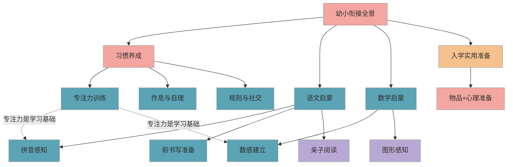
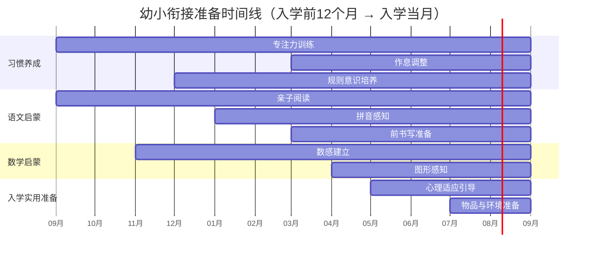

# 幼小衔接入学全景路线图

> 一张图看清入学前所有准备方向和节奏，帮你用 12 个月从容完成幼小衔接——不抢跑、不遗漏、心里有数。

## 1. 全景总览

下图展示幼小衔接的四大准备方向及其内在关系，核心逻辑是"习惯先行，四维并进"：

**解读**：习惯养成是整个衔接的根基——专注力直接影响语文和数学启蒙的效果。四大方向并非先后关系，而是同步推进、互相支撑。入学实用准备包含物品和**心理适应**两部分，后者常被忽视，但对孩子开学后的状态影响很大。

## 2. 时间线规划

下图展示入学前 12 个月到入学当月的推进节奏，帮你把握每个阶段的侧重点（以 9 月入学为例，请根据你孩子的实际入学时间前后平移）：

**节奏提示**：专注力和亲子阅读是"长线投入"，越早开始越好；物品准备不必太早，入学前 1-2 个月集中搞定即可。

## 3. 优先级分级

将所有准备项按重要程度分为三级，帮你聚焦核心、减少焦虑：

| 级别 | 内容 | 说明 |
|------|------|------|
| 🔴 必须掌握 | 专注力（能安静坐 15 分钟）、基本作息规律、握笔姿势基本正确、10 以内数感、声母韵母初步认知 | 不具备会直接影响开学后的课堂跟进 |
| 🟡 提前会更好 | 规则意识与课堂纪律感、简单拼读组合、凑十法概念、书包整理能力、心理适应引导 | 有基础的孩子适应更快，但入学后也能逐步建立 |
| 🟢 后续再学也行 | 复杂拼读组合、图形分类进阶、亲子阅读量的拓展、复杂文具使用、社交技巧进阶 | 一年级课程会系统教授，按校内节奏跟进即可 |

> 课标明确要求一年级上学期为"入学适应期"，学校会留出充分时间帮孩子过渡。你只需确保 🔴 项到位，其余量力而行。

## 4. 模块速览

### 4.1 习惯养成

核心目标是帮孩子建立**坐得住、管得了、处得来**三大基础能力。专注力训练是重中之重，建议从入学前 12 个月开始，每天固定"书桌时间"，从 5 分钟起步逐步延长到 20 分钟。作息调整在入学前半年启动，让生物钟逐步靠近校园节奏。

### 4.2 语文启蒙

以**亲子阅读**培养语感和阅读兴趣，以**拼音感知**建立声韵母的基本认知。课标要求一年级上学期认识约 300 个常用字（不是网传的 500 字），拼音集中教学约 6-8 周。你需要做的不是"提前学完"，而是让孩子对文字和拼音"不陌生"。

### 4.3 数学启蒙

建立**数感**是核心——让孩子理解数字代表的实际数量，而非机械背诵"1+1=2"。通过数实物、比多少、分糖果等生活场景自然渗透。图形感知作为探索拓展，在日常中随机渗透即可（如认形状、搭积木）。

### 4.4 入学实用准备

包括物品准备（文具、书包、校服等）和**心理适应**（对新环境的期待感、对新规则的接受度）。建议入学前带孩子参观学校、聊聊"小学和幼儿园有什么不同"，帮孩子建立积极的入学期待，而非恐惧感。

## 5. 家长自查清单

### 5.1 习惯养成

- [ ] 孩子能安静坐在书桌前专注做事 15 分钟以上
- [ ] 每天有固定的起床和睡觉时间（与校园作息基本一致）
- [ ] 能自己穿衣、如厕、洗手，不依赖大人帮忙
- [ ] 握笔姿势基本正确（拇指食指捏笔，中指托笔）
- [ ] 理解"上课要坐好、举手再发言"等基本课堂规则

### 5.2 语文启蒙

- [ ] 能区分声母和韵母的概念（不要求全部会读）
- [ ] 能认读 6 个单韵母（a o e i u v）
- [ ] 能写自己的名字（不要求工整，写出来即可）
- [ ] 每周有 3 次以上亲子阅读

### 5.3 数学启蒙

- [ ] 认识数字 1-20，能数出对应数量的物品
- [ ] 理解"多""少""一样多"的比较概念
- [ ] 能完成 5 以内的加减（可以借助实物，如掰手指）
- [ ] 能辨认圆形、三角形、正方形、长方形

### 5.4 入学实用准备

- [ ] 文具和书包已采购，孩子练习过自己打开和整理
- [ ] 带孩子参观过学校或看过学校的照片和视频
- [ ] 和孩子聊过"小学和幼儿园有什么不同"
- [ ] 孩子对上小学表现出期待而非恐惧

## 6. 常见误区与建议

### 6.1 易错点

- ❌ 入学前半年疯狂刷题，把一年级上册内容全学完 → ✅ 重点建立习惯和基础认知，"不陌生"比"全会了"重要得多——提前学完反而可能导致孩子上课觉得"我都会了"而不认真听讲
- ❌ 只关注识字和算术，忽略自理能力和社交能力 → ✅ 课标明确要求身心、生活、社会、学习四维均衡准备，习惯养成才是根基
- ❌ 看到别人家孩子会背 50 首古诗就焦虑 → ✅ 对照上方"优先级分级"，🔴 项做到就足够了，知识层面的差距入学后几周就能追上
- ❌ 觉得"幼儿园不教了，得靠自己全搞定" → ✅ 课标要求幼儿园大班开展入学准备教育，一年级设有适应期，家校园三方协同才是正确姿势

### 6.2 实操建议

1. **从今天开始"书桌时间"**：每天固定 15-20 分钟，内容不限（画画、拼图、涂色、翻绘本都行），核心是建立"坐下来做事"的习惯
2. **每月对照自查清单**：用上方清单追踪进度，做到的打勾，没做到的下个月重点关注，不必每项都满分
3. **聚焦红色优先级**：精力有限时，只盯 🔴 必须掌握项，🟡 和 🟢 顺其自然
4. **让孩子参与准备过程**：和孩子一起看这张全景图，让 ta 知道"我们在为上小学做准备"，建立主动感和期待感
5. **预留适应缓冲期**：入学后第 1 个月是适应期，允许孩子有情绪波动和小状况，不要因为短暂的不适而否定之前的准备

## 7. 相关推荐

| 推荐内容 | 说明 | 链接 |
|----------|------|------|
| 专注力训练方法 | 习惯养成的第一步 | [查看](../content/habits/专注力训练方法.md) |
| 声母韵母分类与拼读 | 语文启蒙从拼音开始 | [查看](../content/chinese/声母韵母分类与拼读.md) |
| 数感建立与数量对应 | 数学启蒙从数感开始 | [查看](../content/math/数感建立与数量对应.md) |

[← 返回 K0 目录](../README.md)

---

*最后更新：2026-03-06*

---

> 本资料基于公开知识点整理，仅供个人学习参考。如有侵权请联系删除。
