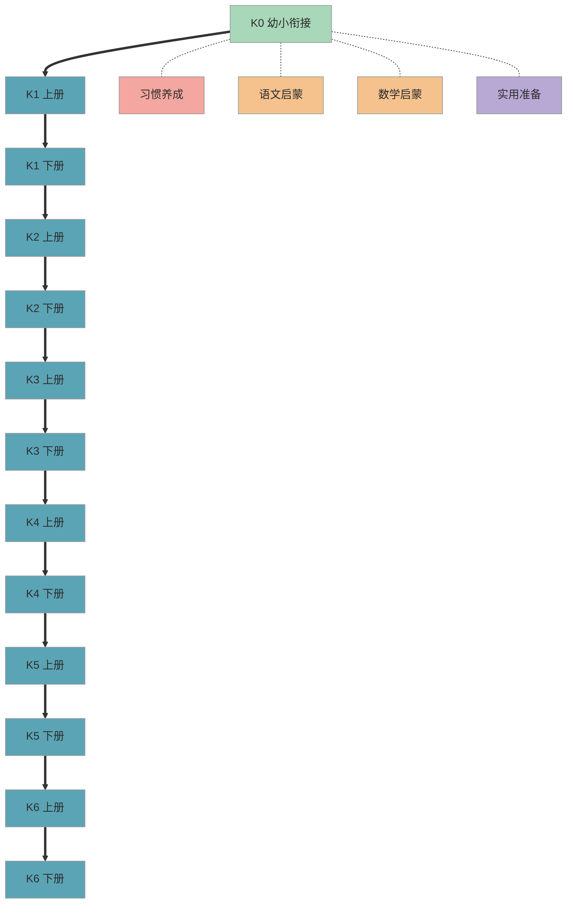

# EduAtlas 全览地图

> 一张图看清从幼小衔接到小学毕业的完整知识体系。点击任意阶段进入详情。

## 1. 全景知识图谱

> 图例：绿色 = 已完成 | 蓝色 = 待建设 | 红色 = 习惯 | 橙色 = 学科 | 紫色 = 实用

## 2. 阶段总览

| 阶段 | 名称 | 核心目标 | 内容数 | 状态 | 入口 |
|------|------|----------|--------|------|------|
| K0 | 幼小衔接 | 习惯建立 + 基础启蒙 + 入学准备 | 13 篇 | 已完成 | [进入](K0-preschool/README.md) |
| K1 上 | 一年级上学期 | — | — | 待建设 | — |
| K1 下 | 一年级下学期 | — | — | 待建设 | — |
| K2 上 | 二年级上学期 | — | — | 待建设 | — |
| K2 下 | 二年级下学期 | — | — | 待建设 | — |
| K3 上 | 三年级上学期 | — | — | 待建设 | — |
| K3 下 | 三年级下学期 | — | — | 待建设 | — |
| K4 上 | 四年级上学期 | — | — | 待建设 | — |
| K4 下 | 四年级下学期 | — | — | 待建设 | — |
| K5 上 | 五年级上学期 | — | — | 待建设 | — |
| K5 下 | 五年级下学期 | — | — | 待建设 | — |
| K6 上 | 六年级上学期 | — | — | 待建设 | — |
| K6 下 | 六年级下学期 | — | — | 待建设 | — |

## 3. 多视角索引

除了按阶段浏览，你还可以通过以下视角快速找到需要的内容：

| 视角 | 适合场景 | 链接 |
|------|----------|------|
| 按学科 | "我想看数学/语文相关的所有内容" | [按学科索引](indexes/by-subject.md) |
| 重难点速查 | "时间有限，只看重点" | [重难点速查](indexes/key-points.md) |
| 易错点清单 | "孩子老是错在哪里" | [易错点清单](indexes/common-mistakes.md) |

## 4. 如何使用本知识库

1. **首次访问**：先看本页全景图，了解整体结构
2. **确定阶段**：点击你孩子所在阶段的入口，进入阶段详情
3. **按需深入**：在阶段页面中，按推荐顺序阅读，或使用索引跳转到感兴趣的内容
4. **重点标记**：标注为"重点"或"难点"的内容优先阅读

---

*最后更新：2026-03-06*
